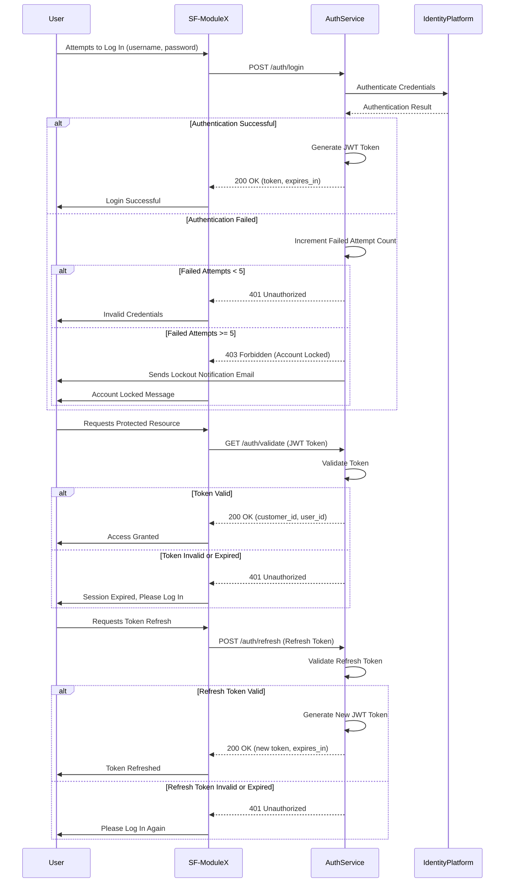

**StudioFlow Auth Service Module Specification**

---

## **Overview**

The StudioFlow Auth Service provides centralized authentication and authorization for all modules in the StudioFlow application. Using a microservices architecture on Google Cloud Platform (GCP), this service authenticates users, associates them with a `customer_id`, issues JWT tokens, and enforces access control across modules by restricting data access to the user's specific `customer_id`.

### **Objectives**

1. **Scalable, Secure Authentication**: Provide a secure authentication system for users to access the StudioFlow application.
2. **Multi-Environment Setup**: Support DEV, UAT, and PRD environments, deployed with Infrastructure as Code (IaC).
3. **Token-Based Access Control**: Issue JWT tokens containing user and customer information, enabling other modules to restrict access by `customer_id`.
4. **Cost Efficiency**: Maintain cost-effective design, balancing performance with GCP resource usage.

---

## **Technology Stack and Architecture Overview**

The StudioFlow Auth Service leverages Google Cloud Platform (GCP) services to provide secure, scalable authentication and access control. Key components ensure environment isolation, resource optimization, and simplified deployment using Infrastructure as Code (IaC) principles.

### **Core Components**

1. **Identity Platform**: Centralized authentication provider that handles user authentication and issues JWT tokens. Each JWT includes user information and `customer_id` for data access control across modules.
2. **Cloud Functions**: Stateless, serverless functions handle custom authentication logic, including token validation and user management, allowing secure and cost-effective compute.
3. **Firestore**: Stores user metadata such as `customer_id`, roles, and permissions, enabling easy lookup for access control and auditing.
4. **Local Caching Strategy**: Implement a simple, secure in-memory caching mechanism within Cloud Functions to limit frequent Firestore access.
   - **Caching Mechanism**: Use in-memory variables within Cloud Functions to cache data during execution.
   - **Cache Duration**: Data is cached for the lifespan of the Cloud Function instance.
   - **Fallback**: On a cold start or when cached data is unavailable, read from Firestore and update the in-memory cache.
5. **Cloud Logging & Monitoring**: Provides real-time logging and metrics to track usage patterns, monitor security, and detect anomalies.
6. **Terraform (IaC)**: Manages the setup of DEV, UAT, and PRD environments within a single GCP project, ensuring consistent configurations across environments, including resource creation, IAM permissions, and budget tracking.
7. **Reusable React Frontend Component**: A React component for the authentication user interface (login, registration, etc.), which can be reused across all modules to ensure a consistent user experience in the StudioFlow application.

### **Key Architecture Aspects**

1. **Authentication and Token Management**: Identity Platform issues JWT tokens that include necessary user and `customer_id` details, ensuring seamless access control across microservices while avoiding direct data access between customers.
2. **Authorization Enforcement**: Tokens include `customer_id`, enabling each module to enforce data restrictions based on this identifier.
3. **Environment Isolation**: Use Terraform to manage separate environments (DEV, UAT, PRD) within a single GCP project, utilizing resource naming conventions and IAM policies to ensure isolation.
4. **Handling Network Issues**: Authentication services require network connectivity to function. In case of network issues, the application will gracefully handle errors and inform users that authentication actions cannot be performed until connectivity is restored.
5. **Consistent Frontend Login**: The React component ensures that all modules present a unified login experience, helping maintain branding consistency and simplifying future maintenance.
6. **Single Source of Truth**: The Auth Service acts as the single source of truth for authentication and authorization. All modules rely solely on the Auth Service to manage user data and permissions, ensuring consistency and security.

---

## **API Contracts**

APIs allow other modules to authenticate users, retrieve JWT tokens, and enforce access control by `customer_id`.

### **1. POST /auth/login**

- **Description**: Authenticates a user and returns a JWT token.
- **Request**:
  - Body: `{ "username": "string", "password": "string" }`
- **Response**:
  - Success: `{ "token": "JWT", "expires_in": "3600" }`
  - Error: `{ "error": "string", "error_code": "400/401/403/429/500" }`
- **Response Headers**:
  - `Content-Type`: `application/json`
  - `Cache-Control`: `no-store`
  - `X-RateLimit-Limit`: Maximum requests allowed within a timeframe.
  - `X-RateLimit-Remaining`: Number of requests left for the timeframe.
- **Error Codes**:
  - `400`: Bad Request - Invalid request format.
  - `401`: Unauthorized - Invalid credentials.
  - `403`: Forbidden - User account locked.
  - `429`: Too Many Requests - API rate limit exceeded.
  - `500`: Internal Server Error - Unexpected issue on the server side.
- **Rate Limiting**:
  - Implement rate limiting using Cloud Functions to prevent abuse.
  - Maximum Requests: 100 requests per minute per IP address and per user.
  - **429 Error Handling**: Include `Retry-After` header to indicate when the user can retry.
  - Introduce CAPTCHA challenges after multiple failed attempts.
- **Security Best Practices**:
  - Enforce HTTPS for all endpoints.
  - Use short-lived tokens and manage signing keys using Google Cloud Key Management Service (KMS).
- **Edge Cases**:
  - **Password Reset**:
    - **POST /auth/password-reset**: API for requesting a password reset link.
    - **PUT /auth/password-reset/confirm**: Confirm password reset with new credentials.
  - **Account Lockout**:
    - After `5` failed login attempts, lock the user account for `15 minutes`.
    - The account will automatically unlock after the lockout period.
    - **User Notification**: Notify the user via email about the lockout and when they can attempt to log in again.
    - **Immediate Unlock Option**: Users can reset their password to unlock the account immediately.
  - **Session Management**:
    - Refresh tokens should be stored securely using appropriate storage mechanisms.
    - **Session Expiry**: Notify users `5 minutes` before the token expires to prompt them for renewal.

---

### **2. GET /auth/validate**

- **Description**: Validates a JWT token and retrieves associated `customer_id`.
- **Request**:
  - Header: `Authorization: Bearer <JWT>`
- **Response**:
  - Success: `{ "customer_id": "string", "user_id": "string" }`
  - Error: `{ "error": "string", "error_code": "400/401/429/500" }`
- **Response Headers**:
  - `Content-Type`: `application/json`
  - `Cache-Control`: `no-store`
  - `X-RateLimit-Limit`: Maximum requests allowed within a timeframe.
  - `X-RateLimit-Remaining`: Number of requests left for the timeframe.
- **Error Codes**:
  - `400`: Bad Request - Invalid or malformed token.
  - `401`: Unauthorized - Token expired or not valid.
  - `429`: Too Many Requests - API rate limit exceeded.
  - `500`: Internal Server Error - Unexpected issue on the server side.
- **Rate Limiting**:
  - Implement rate limiting using Cloud Functions to prevent abuse.
  - Maximum Requests: 100 requests per minute per user.
  - **429 Error Handling**: Include `Retry-After` header.
- **Security Best Practices**:
  - Enforce HTTPS for all endpoints.
  - Use short-lived tokens and manage signing keys using Google Cloud KMS.
- **Edge Cases**:
  - **Token Expiry**:
    - Return `401 Unauthorized` when the token has expired, prompting the user to refresh their token.
  - **Malformed Token**:
    - Return `400 Bad Request` for malformed or tampered tokens.
  - **Invalid Signature**:
    - Return `401 Unauthorized` for invalid JWT signatures.

---

### **3. POST /auth/refresh**

- **Description**: Refreshes a JWT token.
- **Request**:
  - Header: `Authorization: Bearer <Refresh Token>`
- **Response**:
  - Success: `{ "token": "JWT", "expires_in": "3600" }`
  - Error: `{ "error": "string", "error_code": "400/401/403/429/500" }`
- **Response Headers**:
  - `Content-Type`: `application/json`
  - `Cache-Control`: `no-store`
  - `X-RateLimit-Limit`: Maximum requests allowed within a timeframe.
  - `X-RateLimit-Remaining`: Number of requests left for the timeframe.
- **Error Codes**:
  - `400`: Bad Request - Invalid request format.
  - `401`: Unauthorized - Invalid or expired refresh token.
  - `403`: Forbidden - User account restricted from refreshing token.
  - `429`: Too Many Requests - API rate limit exceeded.
  - `500`: Internal Server Error - Unexpected issue on the server side.
- **Rate Limiting**:
  - Implement rate limiting using Cloud Functions to prevent abuse.
  - Maximum Requests: 100 requests per minute per user.
  - **429 Error Handling**: Include `Retry-After` header.
- **Security Best Practices**:
  - Enforce HTTPS for all endpoints.
  - Use short-lived tokens and manage signing keys using Google Cloud KMS.
- **Edge Cases**:
  - **Expired or Invalid Refresh Token**:
    - Return `401 Unauthorized` and prompt the user to log in again.
  - **Revoked Refresh Token**:
    - Return `401 Unauthorized` if the refresh token has been revoked.
  - **Invalid Token Format**:
    - Return `400 Bad Request` for improperly formatted tokens.
  - **Rate Limiting During High Usage**:
    - Return `429 Too Many Requests` to prevent abuse from rapid token refresh requests.

---

### **Additional Endpoints**

#### **POST /auth/password-reset**

- **Description**: Initiates password reset by sending a reset link to the user's email.
- **Request**:
  - Body: `{ "email": "string" }`
- **Response**:
  - Success: `{ "message": "Password reset link sent if email is registered." }`
  - Error: `{ "error": "string", "error_code": "400/429/500" }`
- **Error Codes**:
  - `400`: Bad Request - Invalid email format.
  - `429`: Too Many Requests - Rate limit exceeded.
  - `500`: Internal Server Error.

#### **PUT /auth/password-reset/confirm**

- **Description**: Resets the user's password using the token from the reset link.
- **Request**:
  - Body: `{ "reset_token": "string", "new_password": "string" }`
- **Response**:
  - Success: `{ "message": "Password reset successful." }`
  - Error: `{ "error": "string", "error_code": "400/401/429/500" }`
- **Error Codes**:
  - `400`: Bad Request - Invalid input.
  - `401`: Unauthorized - Invalid or expired reset token.
  - `429`: Too Many Requests - Rate limit exceeded.
  - `500`: Internal Server Error.

---

## **Development Steps**

### **High-Level Guide for Development in Visual Studio Code and Deployment to the Cloud**

To develop the StudioFlow Auth Service module efficiently, developers should use Visual Studio Code (VS Code) and leverage integrated tools for both local development and cloud deployment.

#### **1. Set Up VS Code**

- **Install Extensions**:
  - **Prettier** for code formatting.
  - **ESLint** for linting JavaScript code.
  - **Terraform** for Infrastructure as Code.
  - **Google Cloud Tools** for seamless cloud integration.
- **Git Integration**:
  - Use built-in **Git** support to manage repositories and collaborate across environments.
- **Environment Setup**:
  - **Node.js**: Use version `16.x` or higher.
  - **Dependencies**:
    - Add required dependencies in `package.json`, including `jsonwebtoken`, `express`, and `firebase-admin`.
    - Install packages using **npm install** or **yarn**.
- **Code Standards**:
  - Use **ESLint** with the Airbnb style guide.
  - Apply **Prettier** for consistent code formatting.

#### **2. Development Workflow**

- **Backend (Node.js Cloud Functions)**:
  - **Create and Test Locally**:
    - Implement Cloud Functions using a functional programming approach.
    - Use **Google Cloud Functions Emulator** or **Firebase Emulators** for local testing.
  - **Debugging**:
    - Utilize VS Code's debugging features to set breakpoints and monitor variables.
- **Frontend (React Components)**:
  - **Develop Reusable Components**:
    - Build React components and test them locally with **npm start**.
    - Use CSS-in-JS libraries or **Sass** for centralized styling.
  - **Custom Hooks**:
    - Develop custom hooks (e.g., `useAuth`) and test them independently.

#### **3. Infrastructure as Code (IaC) with Terraform**

- **Define Cloud Resources**:
  - Write **Terraform** scripts to define GCP resources for Identity Platform, Firestore, and Cloud Functions.
- **Local Testing**:
  - Validate and plan Terraform configurations using the **Terraform CLI**.

#### **4. Deployment to GCP**

- **Use Google Cloud CLI**:
  - Install and configure **Google Cloud CLI** in VS Code's terminal.
- **Deploy Cloud Functions**:
  - Deploy using **Google Cloud SDK** or integrate **CI/CD pipelines** for continuous deployment.
- **Environment Variables and Secrets**:
  - Store sensitive configurations in **Google Secret Manager**.
  - Use environment variables managed securely during deployment.

#### **5. Post-Deployment Monitoring**

- **Log Viewing**:
  - Use **Cloud Logging** and the **Google Cloud Code** extension to monitor logs.
- **Alerts and Monitoring**:
  - Set up **Cloud Monitoring** alerts and manage them via Terraform scripts.

---

### **Step 1: Identity Platform Configuration**

1. **Set Up Identity Platform**:
   - Enable Identity Platform on GCP.
   - Configure authentication providers (e.g., email/password).
2. **JWT Setup**:
   - Configure Identity Platform to issue JWT tokens containing user and `customer_id` fields.
3. **Create Service Account**:
   - Create a service account with necessary permissions for token verification and user management.

### **Step 2: Firestore Setup**

1. **Create Firestore Collections**:
   - **Users**:
     - Fields:
       - `user_id` (string)
       - `customer_id` (string)
       - `roles` (array)
       - `created_at` (timestamp)
       - `updated_at` (timestamp)
     - **Indexes**:
       - Create a compound index on `customer_id` and `roles`.
2. **Configure Security Rules**:
   - Restrict Firestore access to authenticated users and Cloud Functions.

### **Step 3: Cloud Functions for Authentication**

1. **Function Implementations**:
   - **loginUser**: Authenticates the user and retrieves a JWT from Identity Platform.
   - **validateToken**: Validates JWT tokens and extracts `customer_id`.
   - **refreshToken**: Issues new JWT tokens when old tokens expire.
   - **passwordReset**: Handles password reset requests.
   - **passwordResetConfirm**: Confirms password reset with new credentials.
2. **Set Permissions**:
   - Configure IAM roles for secure function access and set `customer_id` restrictions.

### **Step 4: Infrastructure as Code (IaC) Setup**

1. **Create Terraform Scripts**:
   - Use Terraform workspaces or variables to manage DEV, UAT, and PRD environments within a single GCP project.
   - **State Management**:
     - Store state files in Google Cloud Storage (GCS) with encryption enabled.
   - **Role-Based Access Control**:
     - Assign appropriate IAM roles using least privilege principles.
   - **Service Configuration**:
     - Define Identity Platform, Firestore, and Cloud Function configurations.
   - **IAM Role Assignment**:
     - Apply IAM roles for Identity Platform and Firestore access.
2. **Environment Isolation**:
   - Use resource naming conventions (e.g., `dev-auth-service`) to isolate environments.
   - Utilize IAM policies for environment-specific access control.
3. **Budget Tracking and Alerts**:
   - Use Terraform to set budget alerts for each environment.

### **Step 5: Set Up Monitoring and Logging**

1. **Cloud Logging**:
   - **Log Details**:
     - Do not log sensitive information.
     - **Log Levels**:
       - `INFO`: Successful API invocations.
       - `DEBUG`: Detailed debugging information.
       - `ERROR`: Authentication failures, invalid tokens.
   - **Set Up Alerts**:
     - Create alerts for multiple failed login attempts.
2. **Cloud Monitoring**:
   - Create dashboards and set up alerts for critical metrics.

### **Step 6: React Frontend Component Development**

1. **Create Reusable Authentication Component**:
   - Develop a React component for login and registration.
2. **Integration Across Modules**:
   - Ensure easy integration with other StudioFlow modules.
3. **Component Integration**:
   - **Component Props**:
     - Accept `theme` and `redirectURL` for customization.
   - **Example Usage**:
     ```jsx
     import { LoginForm } from '@studioflow/auth';
     ```
   - **Customizable Themes**:
     - Allow style customization through props.

### **Step 7: Integration of Reusable React Frontend and APIs Across Modules**

1. **Package the React Component**:
   - Package as an npm package or library.
2. **API Integration**:
   - Configure modules to interact with authentication APIs.
3. **CORS Configuration**:
   - **Allowed Origins**:
     - Specify trusted domains.
   - **Allowed Methods and Headers**:
     - Define explicitly.
   - **Credentials**:
     - Set `Access-Control-Allow-Credentials` to `true` if necessary.
   - **Security Considerations**:
     - Avoid wildcard origins in production.
4. **Authentication Flow**:
   - Use the authentication component for login and registration.
   - **JWT Token Handling**:
     - Pass tokens in the `Authorization` header.
   - **Token Verification**:
     - Validate tokens before API calls.
5. **Failure Handling**:
   - Handle `401 Unauthorized` by redirecting users to login.
   - Attempt token refresh when tokens expire.
6. **Environment Variables**:
   - Configure base URLs for APIs per environment.
7. **Centralized Styling and Customization**:
   - Allow styling customization to fit module branding.

### **Step 8: Unit Testing and Quality Assurance**

1. **Secure Management of Environment Variables and Secrets**:
   - Use **Google Secret Manager** for sensitive information.
2. **Testing Strategies**:
   - **Unit Testing**:
     - Use **Jest** for backend and frontend components.
   - **Integration Testing**:
     - Test interactions between components and services.
   - **End-to-End Testing**:
     - Use tools like **Cypress** or **Selenium**.
3. **Continuous Integration/Continuous Deployment (CI/CD)**:
   - Set up pipelines with **GitHub Actions** or **GitLab CI/CD**.
4. **Secure Development Practices**:
   - Implement mandatory code reviews.
   - Use static code analysis tools.
5. **Monitoring and Performance Optimization**:
   - Use **Cloud Monitoring** for performance insights.
   - Optimize Cloud Functions to minimize cold starts.
6. **Documentation**:
   - Maintain updated API documentation.
   - Use tools like Swagger/OpenAPI for interactive docs.

---

## **Code and Project Guidelines**

### **Language and Code Structure**

- **Backend**: Implemented using **Node.js** for Cloud Functions.
  - **Functional Approach**: Each Cloud Function is a standalone function corresponding to an API endpoint.
  - **Utilities**: Common utility functions are organized in separate modules.
- **Frontend**: Use **React** for developing reusable components.
  - **Components**: Authentication components (`LoginForm`, `RegisterForm`) are reusable.
  - **Hooks**: Create custom React hooks for API interactions (`useAuth`).
- **Testing**: Use **Jest** for unit testing both backend functions and React components.

### **Project Structure**

```
project-root/
  ├── backend/
  │   ├── cloud-functions/
  │   │   ├── loginUser.js
  │   │   ├── validateToken.js
  │   │   ├── refreshToken.js
  │   │   ├── passwordReset.js
  │   │   ├── passwordResetConfirm.js
  │   │   ├── utils/
  │   │       ├── logger.js
  │   │       ├── tokenUtil.js
  │   │       ├── cacheUtil.js
  │   └── tests/
  │       ├── loginUser.test.js
  │       ├── validateToken.test.js
  ├── frontend/
  │   ├── src/
  │   │   ├── components/
  │   │   │   ├── LoginForm.js
  │   │   │   ├── RegisterForm.js
  │   │   ├── hooks/
  │   │       ├── useAuth.js
  │   ├── tests/
  │       ├── components/
  │           ├── LoginForm.test.js
  ├── infra/
  │   ├── terraform/
  │       ├── main.tf
  │       ├── variables.tf
  │       ├── environments/
  │           ├── dev.tfvars
  │           ├── uat.tfvars
  │           ├── prd.tfvars
  ├── README.md
  └── .gitignore
```

- **Backend**: The `backend` directory contains individual Cloud Functions and utilities.
- **Frontend**: The `frontend` directory includes reusable React components and hooks.
- **Infrastructure**: The `infra/terraform` directory houses configuration files for GCP environments.
- **Version Control**: Managed using **Git**, hosted on platforms like GitHub.
- **Development Environment**: **Visual Studio Code** is recommended for its integration capabilities.

---

## **Cost Estimation Approach Using GCP Pricing Calculator**

- **Identify Usage Metrics**:
  - **Number of Users**: Estimate active users per month.
  - **Function Invocations**: Average number per user per month.
  - **Firestore Operations**: Number of reads/writes per user per month.
- **Input into GCP Pricing Calculator**:
  - **Cloud Functions**:
    - Memory allocation per function.
    - Execution time per invocation.
    - Total monthly invocations.
  - **Firestore**:
    - Total document reads, writes, deletes.
    - Data storage size.
  - **Identity Platform**:
    - Usage beyond the free tier.
  - **Cloud Logging & Monitoring**:
    - Log volume and retention.
- **Consider Additional Costs**:
  - **Networking**: Data egress charges if applicable.
  - **Third-Party Services**: Costs for external services.
- **Assumptions**:
  - Clearly state all assumptions.
  - Include a buffer for unexpected spikes.

---

## **Interaction Diagram**

Below is a Mermaid diagram illustrating the interaction between the Auth Service and a module called SF-ModuleX.



---

## **Unit Testing**

1. **Test JWT Token Generation**:
   - Ensure tokens include `customer_id` and user-specific information.
2. **Token Validation and Expiry**:
   - Validate token functionality and error handling for expired tokens.
3. **User Access Control**:
   - Verify that each API endpoint enforces access based on `customer_id`.
4. **React Component Testing**:
   - Ensure the authentication component works correctly across modules.
5. **Cross-Module Integration Testing**:
   - Test the authentication component's interaction with APIs across modules.
6. **Cache Testing**:
   - Verify the in-memory caching mechanism within Cloud Functions.
7. **Monitoring and Error Handling Testing**:
   - Test logging, alerts, and error responses.
8. **Security Testing**:
   - Conduct penetration testing and vulnerability assessments.

---

This specification provides a secure, scalable foundation for the StudioFlow Auth Service module, ensuring that each customer has isolated, controlled access to their data within the microservices architecture. The inclusion of a reusable React frontend component ensures a consistent and branded login experience across all modules. The use of Infrastructure as Code (IaC) for setup and deployment ensures consistency across environments and simplifies scaling. The Auth Service acts as a siloed, single source of truth for authentication, with a simplified caching mechanism and adherence to best practices to control costs and enhance security.