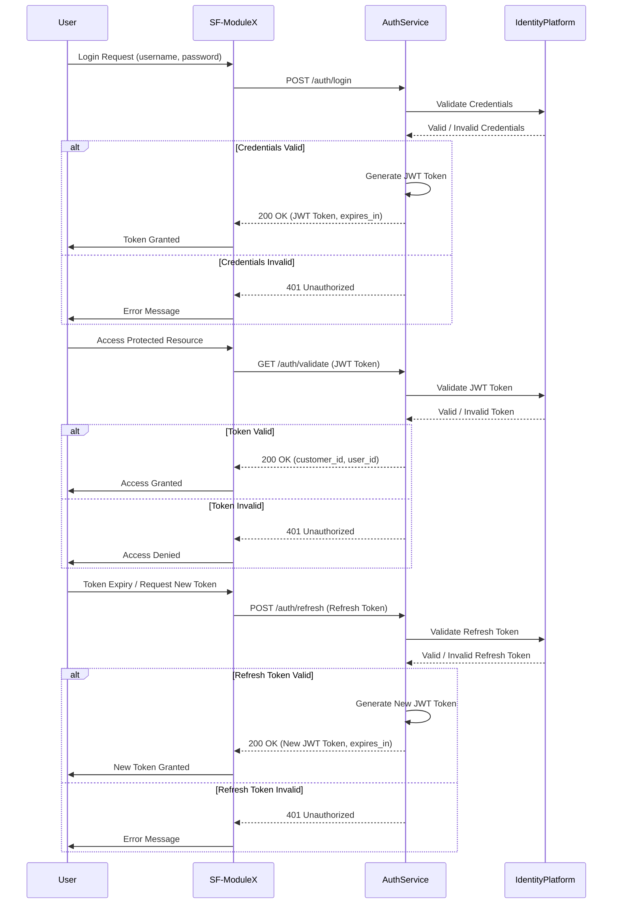

**StudioFlow Auth Service Module Specification**

## **Overview**

The StudioFlow Auth Service will provide centralized authentication and authorization for all modules in the StudioFlow application. This service, using a microservices architecture on Google Cloud Platform (GCP), will authenticate users, associate them with a `customer_id`, issue JWT tokens, and enforce access control across modules, restricting data access to the user’s specific `customer_id`.

### Objectives

1. **Scalable, Secure Authentication**: Provide a secure authentication system for users to access the StudioFlow application.
2. **Multi-Environment Setup**: Support DEV, UAT, and PRD environments, deployed with Infrastructure as Code (IaC).
3. **Token-Based Access Control**: Issue JWT tokens containing user and customer information, enabling other modules to restrict access by `customer_id`.
4. **Cost Efficiency**: Maintain cost-effective design, balancing performance with GCP resource usage.

## **Technology Stack and Architecture Overview**

The StudioFlow Auth Service module leverages Google Cloud Platform (GCP) services to provide secure, scalable authentication and access control. Key components ensure environment isolation, resource optimization, and simplified deployment using Infrastructure as Code (IaC) principles.

### Core Components

1. **Identity Platform**: Centralized authentication provider that handles user authentication, issues JWT tokens, and supports multi-factor authentication (MFA) if required. Each JWT includes user information and `customer_id` for data access control across modules.
2. **Cloud Functions**: Stateless, serverless functions handle custom authentication logic, including token validation and user management, allowing secure and cost-effective compute.
3. **Firestore**: Stores user metadata, such as `customer_id`, roles, and permissions, enabling easy lookup for access control and auditing. To reduce Firestore costs, caching mechanisms will be used locally to minimize the number of read operations.
4. **Without Local Caching**: Implement a local cache to store user metadata and tokens, thereby reducing Firestore read costs. This cache will store data temporarily to limit frequent Firestore access and will refresh based on set expiration policies.
5. **Cloud Logging & Monitoring**: Provides real-time logging and metrics to track usage patterns, monitor security, and detect anomalies.
6. **Terraform (IaC)**: Manages the setup of DEV, UAT, and PRD environments, ensuring consistent configurations across projects, including resource creation, IAM permissions, and budget tracking.
7. **Reusable React Frontend Component**: A React component for the authentication user interface (login, registration, etc.), which can be reused across all modules to ensure a consistent user experience in the StudioFlow application.

### Key Architecture Aspects

1. **Authentication and Token Management**: Identity Platform issues JWT tokens that include necessary user and `customer_id` details, ensuring seamless access control across microservices while avoiding direct data access between customers.
2. **Authorization Enforcement**: Tokens issued by the Identity Platform include `customer_id`, enabling each module to enforce data restrictions based on this identifier.
3. **Environment Isolation**: Separate projects are set up for DEV, UAT, and PRD environments using Terraform, with distinct IAM policies, resource quotas, and budgets, ensuring strict security and compliance across different environments.
4. **Handling Intermittent Network Issues**: The system will handle intermittent network issues by allowing the authentication service to continue functioning locally during network outages. Tokens will have an expiry period of 1 hour, and a grace period will be established to provide limited functionality if the network is temporarily unavailable.
5. **Consistent Frontend Login**: The React component ensures that all modules present a unified login experience, helping maintain branding consistency and simplifying future maintenance.
6. **Single Source of Truth**: The Auth Service will be completely siloed, acting as the single source of truth for authentication and authorization. All modules will rely solely on the Auth Service to manage user data and permissions, ensuring consistency and security.

## **API Contracts**

APIs allow other modules to authenticate users, retrieve JWT tokens, and enforce access control by `customer_id`.

### 1. **POST /auth/login**

- **Description**: Authenticates a user and returns a JWT token.
- **Request**:
  - Body: `{ "username": "string", "password": "string" }`
- **Response**:
  - Success: `{ "token": "JWT", "expires_in": "3600" }`
  - Error: `{ "error": "string", "error_code": "401/403/500" }`
- **Error Codes**:
  - `401`: Unauthorized - Invalid credentials.
  - `403`: Forbidden - User account locked or access restricted.
  - `500`: Internal Server Error - Server-side issue.

### 2. **GET /auth/validate**

- **Description**: Validates a JWT token and retrieves associated `customer_id`.
- **Request**:
  - Header: `Authorization: Bearer <JWT>`
- **Response**:
  - Success: `{ "customer_id": "string", "user_id": "string" }`
  - Error: `{ "error": "string", "error_code": "400/401/500" }`
- **Error Codes**:
  - `400`: Bad Request - Invalid or malformed token.
  - `401`: Unauthorized - Token expired or not valid.
  - `500`: Internal Server Error - Server-side issue.

### 3. **POST /auth/refresh**

- **Description**: Refreshes a JWT token.
- **Request**:
  - Header: `Authorization: Bearer <Refresh Token>`
- **Response**:
  - Success: `{ "token": "JWT", "expires_in": "3600" }`
  - Error: `{ "error": "string", "error_code": "401/403/500" }`
- **Error Codes**:
  - `401`: Unauthorized - Invalid refresh token.
  - `403`: Forbidden - User account restricted from refreshing token.
  - `500`: Internal Server Error - Server-side issue.

## **Development Steps**

### High-Level Guide for Development in Visual Studio Code and Deployment to the Cloud

To develop the StudioFlow Auth Service module efficiently, developers should use Visual Studio Code (VS Code) and leverage integrated tools for both local development and cloud deployment. Below are the suggested steps for utilizing VS Code during the development process and deploying to Google Cloud Platform (GCP):

1. **Set Up VS Code**:
   - **Install Extensions**: Add essential extensions such as **Prettier** for code formatting, **ESLint** for linting JavaScript code, **Terraform** for Infrastructure as Code, and **Google Cloud Tools** for seamless cloud integration.
   - **Git Integration**: Use the built-in **Git** support in VS Code to clone the repository, manage branches, and track code changes. This will also help with collaboration across different environments (DEV, UAT, PRD).

2. **Development Workflow**:
   - **Backend (Node.js Cloud Functions)**:
     - **Create and Test Locally**: Implement Cloud Functions using Node.js and utilize **Google Cloud Functions Emulator** or **Firebase Emulators** to run and test functions locally.
     - **Debugging**: Use VS Code's built-in debugging features to set breakpoints and monitor variable values.
   - **Frontend (React Components)**:
     - **Develop Reusable Components**: Use VS Code to develop React components and test them locally using **npm start**. Create centralized styling using CSS-in-JS libraries or **Sass** if required.
     - **Custom Hooks**: Develop custom hooks (e.g., `useAuth`) and test them independently in different scenarios using VS Code’s testing tools.

3. **Infrastructure as Code (IaC) with Terraform**:
   - **Define Cloud Resources**: Write **Terraform** scripts in VS Code to define GCP resources for Identity Platform, Firestore, and Cloud Functions.
   - **Local Testing**: Test Terraform configuration using **Terraform CLI** directly in VS Code's terminal to validate and plan changes before deploying.

4. **Deployment to GCP**:
   - **Use Google Cloud CLI**: Install and configure **Google Cloud CLI** in VS Code's integrated terminal to authenticate and deploy services to GCP.
   - **Deploy Cloud Functions**: Deploy from VS Code using the **Google Cloud SDK** or integrate **GitHub Actions** for continuous deployment, ensuring consistent deployment to DEV, UAT, and PRD environments.
   - **Environment Variables**: Store environment-specific configurations (DEV, UAT, PRD) in `.env` files and use VS Code's environment manager extensions to manage these settings securely during deployment.

5. **Post-Deployment Monitoring**:
   - **Log Viewing**: After deploying to GCP, use **Cloud Logging** to monitor logs from VS Code. Install **Google Cloud Code** extension to view logs directly in the editor.
   - **Alerts and Monitoring**: Set up **Google Cloud Monitoring** alerts, and use VS Code to create and manage these alerts in Terraform scripts.

### Step 1: Identity Platform Configuration

1. **Set Up Identity Platform**: Enable Identity Platform on GCP and configure authentication providers (e.g., email/password, social logins).
2. **JWT Setup**: Configure Identity Platform to issue JWT tokens containing user and `customer_id` fields.
3. **Create Service Account**: For secure access by Cloud Functions, create a service account with the necessary permissions for token verification and user management.

### Step 2: Firestore Setup

1. **Create Firestore Collections**:
   - **Users**: Store user metadata, including `customer_id`, roles, and permissions.
2. **Configure Security Rules**: Restrict Firestore access to authenticated users and Cloud Functions.

### Step 3: Cloud Functions for Authentication

1. **Function 1: Login Handler**
   - **Description**: Authenticates the user and retrieves a JWT from Identity Platform.
2. **Function 2: Token Validation**
   - **Description**: Validates JWT tokens and extracts `customer_id`.
3. **Function 3: Refresh Token Handler**
   - **Description**: Issues new JWT tokens when old tokens expire.
4. **Set Permissions**: Configure IAM roles for secure function access and set `customer_id` restrictions.

### Step 4: Infrastructure as Code (IaC) Setup

1. **Create Terraform Scripts**:
   - **Project Creation**: Automate the creation of DEV, UAT, and PRD projects using Terraform.
   - **Service Configuration**: Define Identity Platform, Firestore, and Cloud Function configurations within each project, ensuring consistent setup across environments.
   - **IAM Role Assignment**: Apply IAM roles for Identity Platform and Firestore access to Cloud Functions and authorized users.
2. **Environment Isolation**: Ensure each project (DEV, UAT, PRD) has isolated resources and IAM permissions. Define environment variables to ensure appropriate configurations are loaded in each environment.
3. **Budget Tracking and Alerts**: Use Terraform to set budget alerts for each environment to avoid unexpected cost spikes.

### Step 5: Set Up Monitoring and Logging

1. **Cloud Logging**: Enable logging for all Cloud Functions and Identity Platform events.
2. **Cloud Monitoring**: Create alerts for login anomalies and monitor function invocations.

### Step 6: React Frontend Component Development

1. **Create Reusable Authentication Component**: Develop a React component that handles user login, registration, and password management.
2. **Integration Across Modules**: Ensure that the React component can be easily integrated with other StudioFlow modules to provide a consistent user experience.
3. **Testing and Validation**: Verify the functionality of the React component across different modules to ensure a consistent and secure authentication flow.

### Step 7: Integration of Reusable React Frontend and APIs Across Modules

1. **Package the React Component**: Package the reusable authentication React component so that it can be imported as an npm package or a library in other React projects.
2. **API Integration**: Configure each module to interact with the authentication APIs (`/auth/login`, `/auth/validate`, `/auth/refresh`). This integration should be seamless and provide consistency across all modules.
3. **Cross-Project GCP Setup**: Since the React frontend and other modules are separate GCP projects, use secure endpoints for API calls and set up proper CORS configurations to allow cross-origin requests from trusted domains.
4. **Authentication Flow**: Each module will import the React authentication component, which will handle login and registration. Once logged in, the JWT token received will be used for all subsequent API calls, ensuring consistent authentication and authorization across different modules.
5. **Environment Variables**: Use environment variables to configure the base URL for authentication APIs, ensuring that each module can connect to the correct environment (DEV, UAT, PRD).
6. **Centralized Styling and Customization**: Allow customization of the authentication component's styling through props or themes, ensuring consistency while allowing slight customization to fit the branding of individual modules if needed.

### Step 8: Adding SMS-Based MFA (Optional)

1. **Enable SMS-Based MFA in Identity Platform**: Configure the Identity Platform to support SMS-based MFA for additional security. This involves setting up an SMS provider and enabling MFA for users who require enhanced security.
2. **Cloud Function for MFA Verification**: Create a Cloud Function to handle MFA verification, ensuring that a user who opts for MFA is prompted to enter a code received via SMS after their initial login.
3. **Best Practices for MFA**:
   - **Step-Up Authentication**: Only prompt for MFA during sensitive actions or when a user logs in from an unfamiliar device.
   - **Grace Period Handling**: Implement a grace period where users do not need to re-authenticate using MFA within a specified timeframe unless a significant change (e.g., device or location) is detected.
   - **Secure Code Transmission**: Use short-lived, securely generated codes for SMS to prevent any potential misuse.

## **Code and Project Guidelines**

### Language and Code Structure

- **Backend**: Implemented using **Node.js** for Cloud Functions.
  - **Classes**: Create a class `AuthService` with methods `loginUser()`, `validateToken()`, `refreshToken()`, and `verifyMFA()`. Each method should correspond to the API endpoints.
  - **Utilities**: Include helper functions for handling common tasks such as error logging (`logError()`), token generation (`generateToken()`), and caching (`cacheUserData()`).
- **Frontend**: Use **React** for developing reusable components.
  - **Components**: Authentication components (`LoginForm`, `RegisterForm`, `MFAForm`) should be reusable across all modules.
  - **Hooks**: Create custom React hooks for API interactions (e.g., `useAuth()` for login, token refresh, etc.).
- **Testing**: Use **Jest** for unit testing both backend functions and React components.

### Project Structure

```
project-root/
  ├── backend/
  │   ├── cloud-functions/
  │   │   ├── auth/
  │   │   │   ├── index.js
  │   │   │   ├── AuthService.js
  │   │   │   ├── mfaHandler.js
  │   │   ├── utils/
  │   │   │   ├── logger.js
  │   │   │   ├── cache.js
  │   └── tests/
  │       ├── authService.test.js
  ├── frontend/
  │   ├── src/
  │   │   ├── components/
  │   │   │   ├── LoginForm.js
  │   │   │   ├── RegisterForm.js
  │   │   │   ├── MFAForm.js
  │   │   ├── hooks/
  │   │   │   ├── useAuth.js
  │   │   └── styles/
  │   └── tests/
  │       ├── components/
  │       │   ├── LoginForm.test.js
  ├── infra/
  │   ├── terraform/
  │       ├── dev/
  │       ├── uat/
  │       ├── prd/
  ├── README.md
  └── .gitignore
```

- **Backend**: The `backend` directory contains the Cloud Functions and related utilities, along with the unit tests.
- **Frontend**: The `frontend` directory includes reusable React components, hooks, and their respective unit tests.
- **Infrastructure**: The `infra/terraform` directory houses the configuration files for setting up GCP environments (DEV, UAT, PRD).
- **Version Control**: The entire project will be managed using **Git**, hosted on a platform like GitHub. Version control will be critical for tracking changes and collaboration.
- **Development Environment**: **Visual Studio Code** is recommended for development, as it integrates well with Git and has good support for JavaScript, Node.js, and Terraform.

## **Cost Estimates for Customers**

| Resource                       | Monthly Cost (Approximate)        | Details                                                                                   |
| ------------------------------ | --------------------------------- | ----------------------------------------------------------------------------------------- |
| **Identity Platform**          | Free tier for basic auth          | Typically free for 10,000 active users per month.                                         |
| **Cloud Functions**            | \$0.08 per user (for 9 hours/day) | Based on token validation and refresh invocations; costs scale with user activity.        |
| **Firestore**                  | \$0.0013 per user (basic usage)   | Metadata storage for roles and `customer_id`; costs scale with reads and writes per user. |
| **Cloud Logging & Monitoring** | Minimal, depends on log volume    | Cloud Logging and Monitoring have free tiers; can adjust logging levels to control costs. |
| **SMS MFA (Optional)**         | Varies based on provider          | Costs depend on the number of SMS messages sent and the chosen SMS provider's rates.      |


## **Interaction Diagram**

Below is a Mermaid diagram that illustrates the interaction between the Auth Service and a module called SF-ModuleX. This diagram represents how SF-ModuleX utilizes all aspects of the Auth Service, including login, token validation, and token refresh.



## **Unit Testing**

1. **Test JWT Token Generation**: Ensure tokens include `customer_id` and user-specific information.
2. **Token Validation and Expiry**: Validate token functionality, including error handling for expired tokens.
3. **User Access Control**: Verify that each API endpoint enforces access based on `customer_id`.
4. **React Component Testing**: Ensure the authentication component works correctly across different modules and environments, and validate edge cases like incorrect credentials.
5. **Cross-Module Integration Testing**: Test the authentication component's interaction with APIs across different StudioFlow modules to ensure seamless integration and consistent behavior.
6. **Cache Testing**: Ensure the local caching mechanism properly stores and retrieves data, and falls back to Firestore only when necessary, verifying cache expiration policies.
7. **Network Resilience Testing**: Test the system's behavior during intermittent network outages, ensuring local functionality is maintained during the grace period and tokens are refreshed correctly once the connection is restored.
8. **MFA Testing**: Validate SMS MFA functionality, ensuring that codes are properly generated, transmitted, and verified.

## **Future Considerations**

1. **Multi-Factor Authentication (MFA)**: Add MFA in Identity Platform if additional security is required.
2. **Role-Based Access Control (RBAC)**: Expand role management in Firestore to provide more granular permissions.
3. **Data Analytics**: Add analytics in BigQuery for usage and billing insights based on `customer_id`.
4. **User Activity Logging**: Expand Cloud Logging to capture detailed user activity and interactions across services.
5. **Enhanced Frontend Features**: Add features like account recovery, email verification, and MFA setup to the React component.

---

This specification provides a secure, scalable foundation for the StudioFlow Auth Service module, ensuring that each customer has isolated, controlled access to their data within the microservices architecture. The inclusion of a reusable React frontend component further ensures a consistent and branded login experience across all modules. The use of IaC for setup and deployment further ensures consistency across environments and simplifies scaling. The Auth Service acts as a siloed, single source of truth for authentication, with local caching and resilience mechanisms to handle network issues and control costs.

