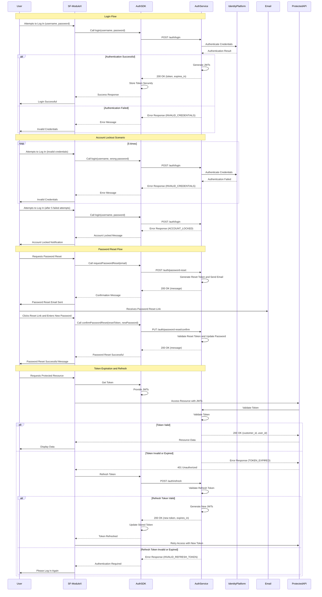

**StudioFlow Auth Service Module Specification**

---

## **Overview**

The StudioFlow Auth Service provides centralized authentication and authorization for all modules in the StudioFlow application. Using a microservices architecture on Google Cloud Platform (GCP), this service authenticates users, associates them with a `customer_id`, issues JWTs, and enforces access control across modules by restricting data access to the user's specific `customer_id`.

### **Objectives**

1. **Scalable, Secure Authentication**: Provide a secure authentication system for users to access the StudioFlow application.
2. **Multi-Environment Setup**: Support DEV, UAT, and PRD environments, deployed with Infrastructure as Code (IaC).
3. **Token-Based Access Control**: Issue JWTs containing user and customer information, enabling other modules to restrict access by `customer_id`.
4. **Cost Efficiency**: Maintain cost-effective design, balancing performance with GCP resource usage.

---

## **Technology Stack and Architecture Overview**

The StudioFlow Auth Service leverages Google Cloud Platform (GCP) services to provide secure, scalable authentication and access control. Key components ensure environment isolation, resource optimization, and simplified deployment using Infrastructure as Code (IaC) principles.

### **Core Components**

1. **Identity Platform**: Centralized authentication provider that handles user authentication and issues JWTs. Each JWT includes user information and `customer_id` for data access control across modules.
2. **Cloud Functions**: Stateless, serverless functions handle custom authentication logic, including token validation and user management, allowing secure and cost-effective compute.
3. **Firestore**: Stores user metadata such as `customer_id`, roles, and permissions, enabling easy lookup for access control and auditing.
   - **Local Emulation for Testing**: Use the **Firebase Local Emulator Suite** to test Firestore interactions, Cloud Functions, and Authentication locally, providing a safe and controlled environment for development and testing.
4. **Cloud Logging & Monitoring**: Provides real-time logging and metrics to track usage patterns, monitor security, and detect anomalies. Logging configurations will vary by environment with DEV, UAT and PRD each having specific log retention and detail levels to match operational needs.
5. **Terraform (IaC)**: Manages the setup of DEV, UAT, and PRD environments using **separate GCP projects for each environment**, ensuring isolation, simplifying IAM management, and enhancing security. Infrastructure is defined using IaC scripts for automation.
   - **Environment Isolation**: Use Terraform scripts to automate the creation and management of separate GCP projects for each environment (DEV, UAT, PRD), enhancing security and simplifying IAM management.
6. **Authentication SDK**: A software development kit that provides authentication functionalities, allowing applications to securely interact with the Auth Service APIs. The SDK handles communication with the Auth Service, token management, and ensures consistent security practices across all modules in the StudioFlow application.
7. **CI/CD Integration**: Incorporate Continuous Integration and Continuous Deployment pipelines using tools like **Cloud Build**, **GitHub Actions**, or **GitLab CI/CD** to automate testing, linting, and deployments, ensuring consistent and reliable releases.

### **Key Architecture Aspects**

1. **Authentication and Token Management**: Identity Platform issues JWTs that include necessary user and `customer_id` details, ensuring seamless access control across microservices while avoiding direct data access between customers.
2. **Authorization Enforcement**: Tokens include `customer_id`, enabling each module to enforce data restrictions based on this identifier.
3. **Environment Isolation**: Use Terraform to manage separate GCP projects for DEV, UAT, and PRD environments, utilizing resource naming conventions and IAM policies to ensure isolation and security.
4. **Handling Network Issues**: Authentication services require network connectivity to function. In case of network issues, the application will gracefully handle errors and inform users that authentication actions cannot be performed until connectivity is restored.
5. **Centralized Authentication Logic via SDK**: The Authentication SDK provides a centralized implementation of authentication logic, ensuring consistent security practices across all modules while allowing each application to develop its own frontend UI.
6. **Single Source of Truth**: The Auth Service acts as the single source of truth for authentication and authorization. All modules rely solely on the Auth Service to manage user data and permissions, ensuring consistency and security.
7. **Continuous Integration/Continuous Deployment**: Integrate CI/CD pipelines to automate testing, linting, and deployments, ensuring code quality and rapid delivery.

### **JWT Token Structure and Claims**

The JWTs issued by the Auth Service will include both standard and custom claims to provide necessary user information.

- **Signing Algorithm**: `RS256` (RSA Signature with SHA-256)

- **Public Key Access**: The public key for verifying JWTs will be available at `https://auth.studioflow.com/.well-known/jwks.json`

- **JWT Payload Structure**:

  ```json
  {
    "iss": "https://auth.studioflow.com",
    "sub": "user_id_value",
    "aud": "studioflow_clients",
    "exp": 1625247600,
    "iat": 1625244000,
    "customer_id": "customer_id_value",
    "user_id": "user_id_value",
    "roles": ["admin", "editor"]
  }
  ```

- **Claims Explanation**:

  - `iss` (Issuer): The issuing authority (`https://auth.studioflow.com`).
  - `sub` (Subject): The user's unique identifier (`user_id`).
  - `aud` (Audience): Intended recipients (`studioflow_clients`).
  - `exp` (Expiration Time): Token expiration timestamp (in Unix epoch time).
  - `iat` (Issued At): Token issuance timestamp.
  - `customer_id`: Custom claim representing the user's associated customer.
  - `user_id`: Redundant to `sub`, included for clarity.
  - `roles`: Array of roles assigned to the user.

## **API Contracts**

APIs allow other modules to authenticate users, retrieve JWTs, and enforce access control by `customer_id`.

### **Standard Error Response Format**

All API endpoints will return errors in the following standardized format:

- **Error Response**:
All error responses will follow the standardized JSON structure below for success and error responses to ensure consistency across modules.

  ```json
  {
    "error": {
      "code": "string",
      "message": "string",
      "details": "string (optional)"
    }
  }
  ```

- **Fields**:
  - `error.code`: A string representing the error code, e.g., `INVALID_CREDENTIALS`, `TOKEN_EXPIRED`.
  - `error.message`: A human-readable message describing the error.
  - `error.details`: Additional details or context about the error (optional).

### **Standard HTTP Status Codes and Error Codes**

The following HTTP status codes and corresponding error codes are used across all API endpoints:

- **400 Bad Request**:
  - **Error Codes**:
    - `INVALID_REQUEST`: The request format is invalid or missing required parameters.
    - `INVALID_INPUT`: Input data validation failed (e.g., invalid email format, password criteria not met).
- **401 Unauthorized**:
  - **Error Codes**:
    - `INVALID_CREDENTIALS`: Incorrect username or password.
    - `INVALID_TOKEN`: The provided token is invalid or malformed.
    - `TOKEN_EXPIRED`: The token has expired.
    - `INVALID_REFRESH_TOKEN`: The refresh token is invalid or expired.
- **403 Forbidden**:
  - **Error Codes**:
    - `ACCOUNT_LOCKED`: User account is locked due to multiple failed login attempts.
    - `REFRESH_NOT_ALLOWED`: User account is restricted from refreshing tokens.
- **429 Too Many Requests**:
  - **Error Codes**:
    - `RATE_LIMIT_EXCEEDED`: The rate limit has been exceeded for the user account.
- **500 Internal Server Error**:
  - **Error Codes**:
    - `INTERNAL_SERVER_ERROR`: An unexpected error occurred on the server side.

**Note**: All error responses will include the appropriate HTTP status code and adhere to the standard error response format defined above.

### **Transmission and Storage of Tokens**

- **Token Transmission**:

  - **Access Token**:

    - Returned in the response body under the key `token`.

  - **Refresh Token**:

    - Returned in the response body under the key `refresh_token`.

- **Example Success Response**:

  ```json
  {
    "token": "access_token_value",
    "refresh_token": "refresh_token_value",
    "expires_in": 900
  }
  ```

- **Client-Side Storage**:

  - **Access Token**:

    - Store securely in memory or secure storage mechanisms.

  - **Refresh Token**:

    - Store in secure HTTP-only cookies to prevent XSS attacks.

  - **Security Considerations**:
    - **Password Policies**:
      - **Minimum Length**: 8 characters.
      - **Complexity Requirements**:
        - Must include at least one uppercase letter, one lowercase letter, one numeral, and one special character (e.g., `!@#$%^&*`).
  
    - Avoid storing tokens in local storage or other insecure locations.

    - Implement measures to protect against CSRF attacks when using cookies.

### **1. POST /auth/login**

- **Description**: Authenticates a user and returns a JWTs.
- **Request**:
  - Body: `{ "username": "string", "password": "string" }`
- **Response**:
  - Success:

    ```json
    {
      "token": "JWT",
      "expires_in": "3600"
    }
    ```

  - Error:

    ```json
    {
      "error": {
        "code": "INVALID_CREDENTIALS",
        "message": "The username or password is incorrect.",
        "details": ""
      }
    }
    ```

- **Response Headers**:
  - `Content-Type`: `application/json`
  - `Cache-Control`: `no-store`
  - `X-RateLimit-Limit`: Maximum requests allowed within a timeframe.
  - `X-RateLimit-Remaining`: Number of requests left for the timeframe.
- **Error Codes**:
  - `INVALID_REQUEST`: Invalid request format.
  - `INVALID_CREDENTIALS`: Incorrect username or password.
  - `ACCOUNT_LOCKED`: User account locked after multiple failed attempts.
  - `RATE_LIMIT_EXCEEDED`: API rate limit exceeded.
  - `INTERNAL_SERVER_ERROR`: Unexpected issue on the server side.
- **Rate Limiting**:
  - Implement rate limiting to prevent abuse.
  - **Maximum Requests**: 100 requests per minute per **user account**.
  - **Note**: Rate limiting is based on user account to avoid unintended denial of service to users behind shared IP addresses.
- **Security Best Practices**:
  - Enforce HTTPS for all endpoints.
  - Use short-lived tokens and manage signing keys using Google Cloud Key Management Service (KMS).
  - **Token Lifetimes and Rotation**
    - **Access Token (`JWT`)**:
      - **Expiration Time**: 15 minutes.
      - **Usage**: Used for authenticating API requests.
      - **Renewal**: Must be refreshed using a valid refresh token upon expiration.
    - **Refresh Token**:
      - **Expiration Time**: 14 days.
      - **Usage**: Used to obtain new access tokens without re-authenticating.
      - **Rotation**: Refresh tokens are rotated upon each use. A new refresh token is issued and the old one invalidated.
      - **Revocation**: Refresh tokens can be revoked if suspicious activity is detected.
    - **Token Revocation Mechanism**:
      - The Auth Service maintains a blacklist of revoked tokens in Firestore.
      - Tokens are checked against the blacklist during authentication and refresh operations.
- **Secure Storage of Tokens**: 
  - All JWTs and refresh tokens will be stored using secure HTTP-only cookies on the client side. Passwords should not be stored on the client side.
- **Edge Cases**:
  - **Account Lockout**:
    - After `5` failed login attempts, lock the user account for `15 minutes`.
    - The account will automatically unlock after the lockout period.
    - **User Notification**: Notify the user via email about the lockout and when they can attempt to log in again.
    - **Immediate Unlock Option**: Users can reset their password to unlock the account immediately.
- **Session Management**:
  - **Token Issuance**:
    - Upon successful login, the server issues both an access token and a refresh token.
  - **Secure Storage**:
    - Both tokens should be stored securely using mechanisms like secure HTTP-only cookies to prevent unauthorized access.
  - **Session Expiry Notification**:
    - Notify users **5 minutes** before the access token expires to prompt them for renewal.
    - The application can automatically attempt to refresh the access token using the refresh token without user intervention.
  - **User Experience**:
    - If the refresh token has expired or is invalid, prompt the user to re-authenticate to obtain new tokens.
    - 
- **Usage Examples**
  - **Request Example**:

    ```bash
    POST https://auth.studioflow.com/auth/login
    Content-Type: application/json

    {
      "username": "user@example.com",
      "password": "password123!"
    }
    ```

  - **Response Example (Success)**:

    ```json
    {
      "token": "access_token_value",
      "refresh_token": "refresh_token_value",
      "expires_in": 900
    }
    ```

  - **Response Example (Error)**:

    ```json
    {
      "error": {
        "code": "INVALID_CREDENTIALS",
        "message": "The username or password is incorrect.",
        "details": ""
      }
    }
    ```

  - **Sample Code (JavaScript using axios)**:

    ```javascript
    axios.post('https://auth.studioflow.com/auth/login', {
      username: 'user@example.com',
      password: 'password123!'
    })
    .then(response => {
      const { token, refresh_token, expires_in } = response.data;
      // Store tokens securely
    })
    .catch(error => {
      // Handle error
    });
    ```

### **2. GET /auth/validate**

- **Description**: Validates a JWTs and retrieves associated `customer_id`.
- **Request**:
  - Header: `Authorization: Bearer <JWT>`
- **Response**:
  - Success:

    ```json
    {
      "customer_id": "string",
      "user_id": "string"
    }
    ```

  - Error:

    ```json
    {
      "error": {
        "code": "TOKEN_EXPIRED",
        "message": "The token has expired.",
        "details": ""
      }
    }
    ```

- **Response Headers**:
  - `Content-Type`: `application/json`
  - `Cache-Control`: `no-store`
  - `X-RateLimit-Limit`: Maximum requests allowed within a timeframe.
  - `X-RateLimit-Remaining`: Number of requests left for the timeframe.
- **Error Codes**:
  - `INVALID_TOKEN`: Invalid or malformed token.
  - `TOKEN_EXPIRED`: Token expired.
  - `RATE_LIMIT_EXCEEDED`: API rate limit exceeded.
  - `INTERNAL_SERVER_ERROR`: Unexpected issue on the server side.
- **Rate Limiting**:
  - Implement rate limiting to prevent abuse.
  - **Maximum Requests**: 100 requests per minute per **user account**.


- **Security Best Practices**:
  - Enforce HTTPS for all endpoints.
  - Use short-lived tokens and manage signing keys using Google Cloud KMS.
- **Edge Cases**:
  - **Token Expiry**:
    - Return `TOKEN_EXPIRED` error when the token has expired, prompting the user to refresh their token.
  - **Malformed Token**:
    - Return `INVALID_TOKEN` error for malformed or tampered tokens.
  - **Invalid Signature**:
    - Return `INVALID_TOKEN` error for invalid JWT signatures.

### **3. POST /auth/refresh**

- **Description**: Refreshes a JWTs.
- **Request**:
  - Header: `Authorization: Bearer <Refresh Token>`
- **Response**:
  - Success:

    ```json
    {
      "token": "JWT",
      "expires_in": "3600"
    }
    ```

  - Error:

    ```json
    {
      "error": {
        "code": "INVALID_REFRESH_TOKEN",
        "message": "The refresh token is invalid or expired.",
        "details": ""
      }
    }
    ```

- **Response Headers**:
  - `Content-Type`: `application/json`
  - `Cache-Control`: `no-store`
  - `X-RateLimit-Limit`: Maximum requests allowed within a timeframe.
  - `X-RateLimit-Remaining`: Number of requests left for the timeframe.
- **Error Codes**:
  - `INVALID_REQUEST`: Invalid request format.
  - `INVALID_REFRESH_TOKEN`: Invalid or expired refresh token.
  - `REFRESH_NOT_ALLOWED`: User account restricted from refreshing token.
  - `RATE_LIMIT_EXCEEDED`: API rate limit exceeded.
  - `INTERNAL_SERVER_ERROR`: Unexpected issue on the server side.
- **Rate Limiting**:
  - Implement rate limiting to prevent abuse.
  - **Maximum Requests**: 100 requests per minute per **user account**.
- **Security Best Practices**:
  - Enforce HTTPS for all endpoints.
  - Use short-lived tokens and manage signing keys using Google Cloud KMS.
- **Secure Storage of Tokens**: 
  - All JWTs and refresh tokens will be stored using secure HTTP-only cookies on the client side.
- **Edge Cases**:
  - **Expired or Invalid Refresh Token**:
    - Return `INVALID_REFRESH_TOKEN` error and prompt the user to log in again.
  - **Revoked Refresh Token**:
    - Return `INVALID_REFRESH_TOKEN` error if the refresh token has been revoked.
  - **Invalid Token Format**:
    - Return `INVALID_REQUEST` error for improperly formatted tokens.
  - **Rate Limiting During High Usage**:
    - Return `RATE_LIMIT_EXCEEDED` error to prevent abuse from rapid token refresh requests.

### **Additional Endpoints**

**Note**: Account registration and role assignment are only possible by an administrator. Users cannot register themselves or manage their profiles through public endpoints. As such, there are no endpoints provided for user registration or profile management.

#### **POST /auth/password-reset**

- **Description**: Initiates password reset by sending a reset link to the user's email.
- **Request**:
  - Body: `{ "email": "string" }`
- **Response**:
  - Success:

    ```json
    {
      "message": "Password reset link sent if email is registered."
    }
    ```

  - Error:

    ```json
    {
      "error": {
        "code": "INVALID_REQUEST",
        "message": "Invalid email format.",
        "details": ""
      }
    }
    ```

- **Error Codes**:
  - `INVALID_REQUEST`: Invalid email format.
  - `RATE_LIMIT_EXCEEDED`: Rate limit exceeded.
  - `INTERNAL_SERVER_ERROR`: Internal server error.
  
- **Reset Token Expiration**: Password reset tokens will expire strictly within 15-30 minutes after issuance. Users must complete the reset within this timeframe; otherwise, they will need to request a new reset link.

#### **PUT /auth/password-reset/confirm**

- **Description**: Resets the user's password using the token from the reset link.
- **Request**:
  - Body: `{ "reset_token": "string", "new_password": "string" }`
- **Response**:
  - Success:

    ```json
    {
      "message": "Password reset successful."
    }
    ```

  - Error:

    ```json
    {
      "error": {
        "code": "INVALID_RESET_TOKEN",
        "message": "Invalid or expired reset token.",
        "details": ""
      }
    }
    ```

- **Error Codes**:
  - `INVALID_REQUEST`: Invalid input.
  - `INVALID_RESET_TOKEN`: Invalid or expired reset token.
  - `RATE_LIMIT_EXCEEDED`: Rate limit exceeded.
  - `INTERNAL_SERVER_ERROR`: Internal server error.

---

## **Development Steps**

The following development steps provide a comprehensive guide for building the StudioFlow Auth Service module. This guide includes setting up the development environment, configuring services, implementing core functionalities, and ensuring quality through testing and deployment practices.

---

### **Step 1: Set Up Development Environment**

#### **1.1 Set Up Visual Studio Code (VS Code)**

To develop efficiently, use **Visual Studio Code (VS Code)** and leverage its integrated tools for local development and cloud deployment.

- **Install Extensions**:
  - **Prettier**: For code formatting.
  - **ESLint**: For linting JavaScript code.
  - **Terraform**: For Infrastructure as Code support.
  - **Google Cloud Tools**: For seamless cloud integration.
- **Git Integration**:
  - Use VS Code's built-in **Git** support to manage repositories and collaborate across environments.
- **Environment Setup**:
  - **Node.js**: Install version `16.x` or higher.
  - **Dependencies**:
    - Add required dependencies in `package.json`, including:
      - `jsonwebtoken`
      - `express`
      - `firebase-admin`
    - Install packages using **npm install** or **yarn**.
- **Code Standards**:
  - Use **ESLint** with the Airbnb style guide for consistent coding standards.
  - Apply **Prettier** for consistent code formatting.

---

### **Step 2: Identity Platform Configuration**

#### **2.1 Set Up Identity Platform**

- **Enable Identity Platform**:
  - Access the GCP console and enable the **Identity Platform** API.
- **Configure Authentication Providers**:
  - Enable **Email/Password** authentication.
  - Configure any additional authentication providers as needed.

#### **2.2 JWT Setup**

- **Setting Custom Claims**:

  - Use the Firebase Admin SDK within Cloud Functions to set custom claims for users.

  - **Example Code**:

    ```javascript
    const admin = require('firebase-admin');

    // Set custom claims for a user
    admin.auth().setCustomUserClaims(uid, {
      customer_id: 'customer_id_value',
      roles: ['admin', 'editor']
    })
    .then(() => {
      // Custom claims set successfully
    })
    .catch(error => {
      // Handle error
    });
    ```

- **When to Set Custom Claims**:

  - Upon user creation by an administrator.

  - When updating user roles or `customer_id`.

- **Usage in Tokens**:

  - The custom claims will be included in the JWT payload issued to the user.


#### **2.3 Create Service Account**

- **Service Account Creation**:
  - Create a service account with necessary permissions for:
    - Token verification.
    - User management.
    - Accessing Firestore.
- **Assign Roles**:
  - Grant roles like **Identity Platform Admin**, **Cloud Functions Developer**, and **Firestore User** as required.

---

### **Step 3: Firestore Setup**

#### **3.1 Create Firestore Collections**

- **Users Collection**:
  - **Document Structure**:
    - `user_id` (string): Unique identifier for the user.
    - `customer_id` (string): Identifier linking the user to a customer.
    - `roles` (array): List of roles assigned to the user.
    - `created_at` (timestamp): Timestamp of user creation.
    - `updated_at` (timestamp): Timestamp of the last update.
  - **Indexes**:
    - Create a compound index on `customer_id` and `roles` to optimize queries.

#### **3.2 Configure Security Rules**

- **Firestore Security Rules**:
  - Restrict access to authenticated users and specific Cloud Functions.
  - Ensure users can only access their own data based on `customer_id`.
  - Example Rule:

    ```javascript
    rules_version = '2';
    service cloud.firestore {
      match /databases/{database}/documents {
        match /users/{userId} {
          allow read, write: if request.auth != null && request.auth.uid == userId;
        }
      }
    }
    ```

---

### **Step 4: Cloud Functions for Authentication**

#### **4.1 Function Implementations**

- **Implement the Following Cloud Functions**:
  - **`loginUser`**:
    - Authenticates the user using Identity Platform.
    - Retrieves a JWT containing custom claims.
  - **`validateToken`**:
    - Validates JWTs.
    - Extracts `customer_id` and other claims.
  - **`refreshToken`**:
    - Issues new JWTs when old tokens expire.
  - **`passwordReset`**:
    - Handles password reset requests.
    - Sends password reset emails.
  - **`passwordResetConfirm`**:
    - Confirms password reset with new credentials.
    - Updates the user's password in Identity Platform.

#### **4.2 Set Permissions**

- **IAM Roles for Cloud Functions**:
  - Assign the necessary permissions to Cloud Functions to interact with:
    - Identity Platform.
    - Firestore.
  - Use the principle of least privilege to enhance security.
- **Environment Variables**:
  - Use **Google Secret Manager** to manage sensitive environment variables securely.

---

### **Step 5: Infrastructure as Code (IaC) with Terraform**

#### **5.1 Define Cloud Resources**

- **Write Terraform Scripts**:
  - Define GCP resources for:
    - Identity Platform configurations.
    - Firestore databases and rules.
    - Cloud Functions deployment.
    - IAM roles and permissions.

#### **5.2 Automated Environment Setup**

- **Separate GCP Projects**:
  - Use Terraform to automate the creation of **separate GCP projects for each environment** (DEV, UAT, PRD).
- **Automation Scripts**:
  - Scripts should handle:
    - Project creation.
    - Resource provisioning.
    - IAM role assignments.
    - Network configurations.
- **Environment Configuration Details**
  - **Environment Variables**

    | Variable Name          | Description                                  |
    |------------------------|----------------------------------------------|
    | `IDENTITY_PLATFORM_KEY`| API key for Identity Platform                |
    | `JWT_SIGNING_KEY`      | Private key used for signing JWTs            |
    | `REFRESH_TOKEN_SECRET` | Secret key for signing refresh tokens        |
    | `DATABASE_URL`         | Firestore database connection URL            |
    | `EMAIL_SERVICE_API_KEY`| API key for email service provider           |
    | `ENVIRONMENT`          | Current environment (`dev`, `uat`, `prd`)    |

  - **Sample `.env` File for Development**
    ```dotenv
    IDENTITY_PLATFORM_KEY=your_identity_platform_key
    JWT_SIGNING_KEY=your_jwt_signing_key
    REFRESH_TOKEN_SECRET=your_refresh_token_secret
    DATABASE_URL=https://firestore.googleapis.com/v1/projects/your_project/databases/(default)/documents
    EMAIL_SERVICE_API_KEY=your_email_service_api_key
    ENVIRONMENT=dev
    ```

  - **Terraform Variable Files**
    - Create separate variable files for each environment (e.g., `dev.tfvars`, `uat.tfvars`, `prd.tfvars`).
    - **Example `dev.tfvars`**
      ```hcl
      project_id = "studioflow-dev"
      region     = "us-central1"
      ```

  - **Secret Management**
    - Use **Google Secret Manager** to securely store sensitive variables.
    - Reference secrets in Cloud Functions and other services securely.

#### **5.3 State Management**

- **Terraform State Files**:
  - Store state files in **Google Cloud Storage (GCS)** with encryption enabled.

#### **5.4 Role-Based Access Control**

- **IAM Roles Assignment**:
  - Assign appropriate IAM roles using least privilege principles.
  - Apply roles for Identity Platform and Firestore access.

#### **5.5 Service Configuration**

- **Resource Definitions**:
  - Define configurations for:
    - Identity Platform settings.
    - Firestore indexes and security rules.
    - Cloud Functions with appropriate triggers and environment variables.

#### **5.6 Environment Isolation**

- **Resource Naming Conventions**:
  - Use clear naming conventions (e.g., `dev-auth-service`, `uat-auth-service`) for resources.
- **IAM Policies**:
  - Apply environment-specific IAM policies to restrict access appropriately.

#### **5.7 Budget Tracking and Alerts**

- **Cost Management**:
  - Use Terraform to set up budget alerts for each environment.
  - Monitor spending and receive notifications when thresholds are exceeded.

#### **5.8 Secure Management of Environment Variables and Secrets**

- **Google Secret Manager**:
  - Store all sensitive information securely.
  - Access secrets in a secure and controlled manner.
  
---

### **Step 6: Development Workflow**

#### **6.1 Backend (Node.js Cloud Functions)**

- **Create and Test Locally**:
  - Implement Cloud Functions using a functional programming approach.
  - **Local Emulators**:
    - Use the **Firebase Local Emulator Suite** to emulate Cloud Functions, Firestore, and Authentication locally.
    - Test interactions without deploying to the cloud.
- **Debugging**:
  - Utilize VS Code's debugging features:
    - Set breakpoints.
    - Step through code.
    - Monitor variables and call stacks.
- **Code Organization**:
  - Structure code into modules for reusability and maintainability.

#### **6.2 Authentication SDK Development**

- **Language Support**:
  - Develop the SDK in **JavaScript**, targeting React and other JavaScript applications.
- **Core Functionality**:
  - Implement methods for:
    - `login()`
    - `logout()`
    - `refreshToken()`
    - `passwordReset()`
    - Token management and storage.
- **Token Expiration Handling**: 
  - The SDK will handle token expiration gracefully by attempting to refresh the token automatically and retrying the API call once before failing. If the refresh fails or the token is still invalid, the SDK will notify the application to prompt a re-login.
- **Security**:
  - Ensure secure handling of tokens:
    - Store tokens securely in client applications.
    - Implement token refresh logic.
  - Prevent exposure of sensitive data in logs or error messages.
- **Documentation**:
  - Provide comprehensive documentation:
    - Usage examples.
    - API references.
    - Best practices.
- **Testing**:
  - Write unit tests using **Jest** to cover all SDK functionalities.
  - Aim for high code coverage and reliability.
- **Installation**:
  - Install the SDK via npm:
    ```bash
    npm install studioflow-auth-sdk
    ```
- **Initialization**
  - Import and initialize the SDK in your application:

    ```javascript
    import AuthSDK from 'studioflow-auth-sdk';

    const auth = new AuthSDK({
      apiBaseUrl: 'https://auth.studioflow.com',
      clientId: 'your_client_id', // if applicable
    });
    ```
- **Configuration Options**

  - **apiBaseUrl**: The base URL for the Auth Service API endpoints.

  - **clientId** (optional): The client identifier if using OAuth flows.

  - **Token Storage**:

    - The SDK handles token storage securely.

    - Options can be provided to customize storage mechanisms if needed.

- **Usage Example**
  - **Login**:
    ```javascript
    auth.login('user@example.com', 'password123!')
      .then(() => {
        // Login successful
      })
      .catch(error => {
        // Handle error
      });
    ```

  - **Access Protected Resources**:
    ```javascript
    auth.getToken()
      .then(token => {
        // Use token to access protected APIs
      })
      .catch(error => {
        // Handle error
      });
    ```

  - **Logout**:
    ```javascript
    auth.logout()
      .then(() => {
        // Logout successful
      });
    ```
---

### **Step 7: Deployment to GCP**

#### **7.1 Use Google Cloud CLI**

- **Installation and Configuration**:
  - Install the **Google Cloud CLI**.
  - Authenticate and set up configurations for your GCP projects.

#### **7.2 Deploy Cloud Functions**

- **Deployment Methods**:
  - Use the **Google Cloud SDK** commands.
  - Integrate deployment into **CI/CD pipelines** for automated deployments.
- **Versioning and Rollbacks**:
  - Implement versioning for Cloud Functions.
  - Enable rollbacks in case of deployment issues.

#### **7.3 Environment Variables and Secrets**

- **Secure Configuration**:
  - Use **Google Secret Manager** to store sensitive information.
  - Access secrets securely from Cloud Functions at runtime.
- **Environment-Specific Settings**:
  - Configure environment variables for DEV, UAT, and PRD environments.

---

### **Step 8: Post-Deployment Monitoring**

#### **8.1 Log Viewing**

- **Cloud Logging**:
  - Use **Cloud Logging** to monitor logs from Cloud Functions.
  - Ensure logs do not contain sensitive information.
- **Log Levels**:
  - **INFO**: Successful API invocations.
  - **DEBUG**: Detailed debugging information.
  - **ERROR**: Authentication failures, invalid tokens.

#### **8.2 Alerts and Monitoring**

- **Cloud Monitoring**:
  - Set up dashboards to monitor key metrics.
- **Alerts**:
  - Configure alerts for:
    - Multiple failed login attempts.
    - Function errors.
    - Resource usage thresholds.
- **Management via Terraform**:
  - Use Terraform scripts to manage monitoring resources and alerting policies.

---

### **Step 9: Continuous Integration/Continuous Deployment (CI/CD)**

#### **9.1 Incorporate CI/CD Early**

- **Automation**:
  - Integrate CI/CD pipelines early in the development process to streamline workflows.
- **Tools**:
  - Choose suitable tools such as **GitHub Actions**, **GitLab CI/CD**, or **Cloud Build**.
- **Pipeline Configuration**:
  - Automate processes including:
    - Code linting.
    - Testing (unit, integration).
    - Build and deployment.
  - Deploy code to appropriate environments after passing tests.
- **Cloud Functions Rollback Strategy**:
  - Each Cloud Function deployment will include versioning, allowing quick rollbacks to a stable prior version in the event of deployment issues. Rollbacks can be automated in CI/CD pipelines by tagging previous stable versions and triggering a redeployment if necessary.


#### **9.2 Continuous Monitoring**

- **Feedback Loops**:
  - Use CI/CD pipelines to provide immediate feedback on code quality and build status.
- **Notifications**:
  - Set up notifications for pipeline failures or successes to keep the team informed.

---

### **Step 10: Unit Testing and Quality Assurance**

#### **10.1 Testing Strategies**

#### **Testing Scenarios**

- **Authentication Tests**:
  - **Successful Login**:
    - Verify that valid credentials return a valid JWT and refresh token.
  - **Invalid Credentials**:
    - Test login attempts with incorrect username or password.
  - **Account Lockout**:
    - Ensure that after 5 failed login attempts, the account is locked.
  
- **Token Validation Tests**:
  - **Valid Token**:
    - Validate that a correctly signed token with proper claims is accepted.
  - **Expired Token**:
    - Confirm that expired tokens are rejected with a `TOKEN_EXPIRED` error.
  - **Malformed Token**:
    - Test tokens that are improperly formatted or tampered with.

- **Token Refresh Tests**:
  - **Valid Refresh**:
    - Verify that a valid refresh token issues a new access token.
  - **Invalid Refresh Token**:
    - Test with expired or revoked refresh tokens.

- **Password Reset Tests**:
  - **Request Password Reset**:
    - Ensure that a password reset email is sent when requested.
  - **Confirm Password Reset**:
    - Validate that passwords can be reset using a valid reset token.

- **Rate Limiting Tests**:
  - **Exceeding Limits**:
    - Confirm that exceeding the rate limit returns a `429 Too Many Requests` error.

- **Edge Case Tests**:
  - **Simulate Network Failures**
    - Test how the system handles network timeouts and retries.
  - **Concurrent Requests**:
    - Test handling of concurrent login attempts for the same user.

#### **10.2 Secure Development Practices**

- **Code Reviews**:
  - Implement mandatory code reviews for all changes.
- **Static Code Analysis**:
  - Use tools like **SonarQube** or **ESLint** to detect code smells and vulnerabilities.
- **Dependency Management**:
  - Regularly update dependencies to patch security vulnerabilities.

#### **10.3 Monitoring and Performance Optimization**

- **Cloud Monitoring**:
  - Use monitoring tools to gain insights into performance.
- **Optimize Cloud Functions**:
  - Minimize cold starts by adjusting function configurations.
  - Optimize code for better performance.

#### **10.4 Documentation**

- **API Documentation**:
  - Maintain up-to-date API documentation.
  - Use tools like **Swagger** or **OpenAPI** for interactive documentation.
- **SDK Documentation**:
  - Provide clear guides and references for SDK usage.
  - Include examples and best practices.

---

## **Code and Project Guidelines**

### **Language and Code Structure**

- **Backend**: Implemented using **Node.js** for Cloud Functions.
  - **Functional Approach**: Each Cloud Function is a standalone function corresponding to an API endpoint.
  - **Utilities**: Common utility functions are organized in separate modules.
- **Authentication SDK**:
  - **Language**: Initially developed in **JavaScript** for web applications.
  - **Modules**:
    - **AuthClient**: Handles communication with Auth Service APIs.
    - **TokenManager**: Manages storage and refreshing of JWTs.
    - **ErrorHandler**: Processes and standardizes error messages.
  - **Testing**: Use **Jest** for unit and integration testing.

### **Project Structure**

```
project-root/
├── backend/
│   ├── cloud-functions/
│   │   ├── loginUser.js
│   │   ├── validateToken.js
│   │   ├── refreshToken.js
│   │   ├── passwordReset.js
│   │   ├── passwordResetConfirm.js
│   │   └── utils/
│       ├── logger.js
│       └── tokenUtil.js
│   └── tests/
│       ├── loginUser.test.js
│       └── validateToken.test.js
├── sdk/
│   ├── src/
│   │   ├── AuthClient.js
│   │   ├── TokenManager.js
│   │   └── ErrorHandler.js
│   ├── tests/
│       ├── AuthClient.test.js
│       └── TokenManager.test.js
│   ├── package.json
│   └── README.md
├── infra/
│   └── terraform/
│       ├── main.tf
│       ├── variables.tf
│       └── environments/
│           ├── dev.tfvars
│           ├── uat.tfvars
│           └── prd.tfvars
├── .github/
│   └── workflows/
│       └── ci-cd.yml
├── README.md
└── .gitignore
```

- **Backend**: The `backend` directory contains individual Cloud Functions and utilities.
- **SDK**: The `sdk` directory includes the source code for the Authentication SDK, along with tests and documentation.
- **Infrastructure**: The `infra/terraform` directory houses configuration files for GCP environments.
- **CI/CD Configuration**: The `.github/workflows/ci-cd.yml` file contains CI/CD pipeline configurations using GitHub Actions.
- **Version Control**: Managed using **Git**, hosted on platforms like GitHub.
- **Development Environment**: **Visual Studio Code** is recommended for its integration capabilities.

---

## **Cost Estimation Approach Using GCP Pricing Calculator**

- **Identify Usage Metrics**:
  - **Number of Users**: Estimate active users per month.
  - **Function Invocations**: Average number per user per month.
  - **Firestore Operations**: Number of reads/writes per user per month.
- **Input into GCP Pricing Calculator**:
  - **Cloud Functions**:
    - Memory allocation per function.
    - Execution time per invocation.
    - Total monthly invocations.
  - **Firestore**:
    - Total document reads, writes, deletes.
    - Data storage size.
  - **Identity Platform**:
    - Usage beyond the free tier.
  - **Cloud Logging & Monitoring**:
    - Log volume and retention.
- **Consider Additional Costs**:
  - **Networking**: Data egress charges if applicable.
  - **Third-Party Services**: Costs for external services.
- **Assumptions**:
  - Clearly state all assumptions.
  - Include a buffer for unexpected spikes.

---

## **Interaction Diagram**

Below is a Mermaid diagram illustrating the interaction between the Auth Service, the SDK, and a module called SF-ModuleX, including additional scenarios like account lockout and password reset.



---

## **Unit Testing**

1. **Test JWTs Generation**:
   - Ensure tokens include `customer_id` and user-specific information.
2. **Token Validation and Expiry**:
   - Validate token functionality and error handling for expired tokens.
3. **User Access Control**:
   - Verify that each API endpoint enforces access based on `customer_id`.
4. **SDK Testing**:
   - Ensure the SDK correctly handles API communication, token management, and error handling.
5. **Integration Testing**:
   - Test the SDK's interaction with the Auth Service APIs.
6. **Monitoring and Error Handling Testing**:
   - Test logging, alerts, and error responses.
7. **Security Testing**:
   - Conduct penetration testing and vulnerability assessments on the Auth Service and SDK.
8. **Integration in CI/CD**:
   - Ensure that all tests are run automatically on code commits and before deployments via the CI/CD pipelines.
   - The CI/CD pipelines should be configured to run unit tests, integration tests, and any other automated tests as part of the build process.