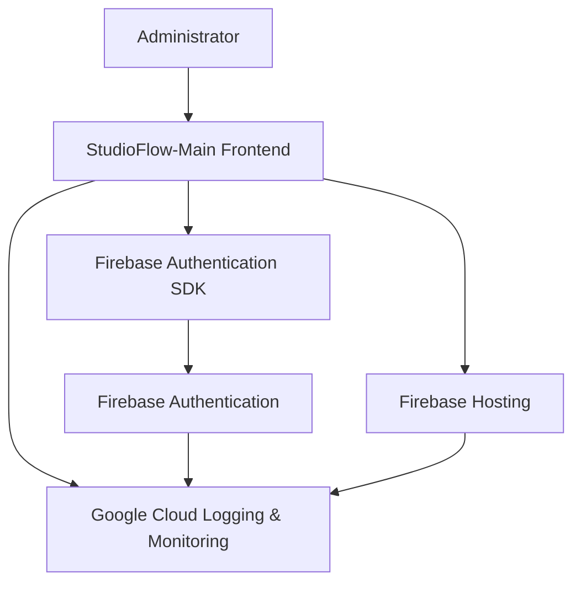

# **StudioFlow-Main Application Framework Specification**

## **Table of Contents**
1. [Overview](#overview)
2. [Technology Stack and Architecture Overview](#technology-stack-and-architecture-overview)
3. [Authentication and Authorization](#authentication-and-authorization)
4. [Frontend Application](#frontend-application)
5. [Infrastructure as Code (IaC) with Terraform](#infrastructure-as-code-iac-with-terraform)
6. [Development Workflow](#development-workflow)
7. [Deployment to Firebase](#deployment-to-firebase)
8. [Post-Deployment Monitoring](#post-deployment-monitoring)
9. [Continuous Integration/Continuous Deployment (CI/CD)](#continuous-integrationcontinuous-deployment-cicd)
10. [Unit Testing and Quality Assurance](#unit-testing-and-quality-assurance)
11. [Project Structure](#project-structure)
12. [Security Considerations](#security-considerations)
13. [Failover, Redundancy, and Disaster Recovery](#failover-redundancy-and-disaster-recovery)
14. [Cost Estimation Approach Using GCP Pricing Calculator](#cost-estimation-approach-using-gcp-pricing-calculator)

---

## **Overview**

The **StudioFlow-Main** application framework serves as the foundational platform for administrators to manage and oversee workflows comprising various modules or microservices, such as auto retouch, capture, approval, and sample check-in. The framework handles user authentication, provides a seamless login experience, and directs authenticated users to the main interface where they can construct and customize their workflows.

**Key Features:**
- **Authentication**: Secure admin and customer login using Firebase Authentication.
- **Landing Page**: A unified login interface requiring Customer ID and username.
- **Main Pages**: Post-login dashboards with a "Welcome to StudioFlow" message, tailored separately for administrators and customers.
- **Scalable Architecture**: Designed to accommodate additional modules/microservices.
- **Infrastructure as Code**: Deployment and resource management via Terraform.
- **CI/CD Integration**: Automated testing and deployment pipelines using GitHub Actions.
- **Responsive Design**: Ensures usability across desktops, tablets, and mobile devices.

---

## **Technology Stack and Architecture Overview**

### **Core Components**
1. **Frontend**:
   - **Framework**: React.js
   - **Language**: JavaScript (ES6+)
   - **Styling**: Material-UI (MUI) with theming.

2. **Authentication**:
   - **Service**: Firebase Authentication
   - **SDK**: Firebase Authentication SDK

3. **Infrastructure**:
   - **Provisioning**: Terraform
   - **Hosting**: Firebase Hosting (Spark Plan)

4. **Version Control**:
   - **Repository**: GitHub

5. **CI/CD**:
   - **Tools**: GitHub Actions

6. **Monitoring and Logging**:
   - **Services**: Google Cloud Monitoring, Google Cloud Logging

### **Architecture Diagram**



*Diagram Description*: Administrators interact with the **StudioFlow-Main Frontend**, which handles authentication via Firebase Authentication SDK. Authenticated requests are managed by Firebase Hosting. All components log activities to Google Cloud Logging & Monitoring for observability.

---

## **Authentication and Authorization**

### **Overview**

Authentication and identity management are handled by **Firebase Authentication**, ensuring secure and scalable user management. The frontend application leverages the Firebase Authentication SDK to manage user sessions, token handling, and secure communication with Firebase services. Only administrators can register users, aligning with the requirement of no self-service registration.

### **Authentication Flow**

1. **User Login**:
   - Users access the **Login Page** and submit their **Customer ID** (if applicable), **username**, and **password**.
   - The **Firebase Authentication SDK** communicates with **Firebase Authentication** to authenticate the user.
   - Upon successful authentication, **Firebase Authentication** issues a **JWT Access Token** and a **Refresh Token**.

2. **Token Management**:
   - **Access Token**: Stored securely in memory within the frontend application. Used for authenticating API requests.
   - **Refresh Token**: Stored in a secure, HTTP-only cookie with `SameSite=Strict` attribute to prevent XSS and CSRF attacks.

3. **Session Handling**:
   - Access tokens have a short lifespan (e.g., 15 minutes) to minimize security risks.
   - Refresh tokens are used to obtain new access tokens without requiring the user to re-authenticate.

### **Authorization**

Authorization is based on user roles (`customer_user` and `studio_admin`) and `customer_id`. Custom claims embedded within JWTs facilitate role-based access control (RBAC) without additional database queries.

**Login Logic:**
- **Admin Users**:
  - **Customer ID**: Left blank during login.
  - **Role**: `studio_admin`
- **Customer Users**:
  - **Customer ID**: Must be provided during login.
  - **Role**: `customer_user`

**Firebase Capability**:
- **Custom Claims**: Firebase Authentication supports adding custom claims to user tokens, allowing differentiation between admin and customer roles based on the presence of `customer_id`.
- **Role Enforcement**: The backend can validate these claims to enforce access controls accordingly.

---

## **Frontend Application**

### **Overview**

The frontend is a React.js application that provides the user interface for authentication and workflow management. It consists of three main pages:

1. **Login Page**: Allows administrators and customers to log in by entering **Customer ID** (if applicable), **username**, and **password**.
2. **Admin Main Page**: Displays administrative controls and dashboards post-login for users with the `studio_admin` role.
3. **Customer Main Page**: Displays customer-specific dashboards and controls post-login for users with the `customer_user` role.

### **Page Descriptions**

1. **Login Page**
   - **Components**:
     - **Customer ID Input**: Field for entering the customer identifier (optional for admins).
     - **Username Input**: Field for admin email or username.
     - **Password Input**: Field for admin password.
     - **Login Button**: Triggers the authentication process.
     - **Error Messages**: Displays authentication errors (e.g., invalid credentials, account locked).

   - **Functionality**:
     - Utilizes the Firebase Authentication SDK to handle user login.
     - Admins can log in without entering a **Customer ID**.
     - Customers must provide a **Customer ID** to log in.
     - Upon successful login, redirects the user to the appropriate Main Page based on their role.
     - Handles and displays error messages based on authentication responses.

2. **Admin Main Page**
   - **Components**:
     - **Welcome Message**: Displays "Welcome to StudioFlow Admin" centered on the page.
     - **Admin Dashboard**: Contains administrative controls, user management interfaces, and workflow configuration tools.

   - **Functionality**:
     - Serves as the central hub for administrators to manage workflows and user accounts.
     - Provides access to advanced features exclusive to admins.
     - Future enhancements will include tools for designing and managing workflows.

3. **Customer Main Page**
   - **Components**:
     - **Welcome Message**: Displays "Welcome to StudioFlow" centered on the page.
     - **Customer Dashboard**: Contains customer-specific dashboards, workflow monitoring, and limited configuration tools.

   - **Functionality**:
     - Serves as the central hub for customers to monitor and manage their workflows.
     - Provides a simplified interface tailored to customer needs.
     - Future enhancements will include additional customer-focused tools and features.

### **User Interface Design**

- **Responsive Design**: Ensures usability across desktops, tablets, and mobile devices.
- **Consistent Styling**: Utilizes Material-UI (MUI) with theming for a cohesive look and feel.
- **Accessibility**: Adheres to accessibility standards (e.g., WCAG level AA) to support all users.

### **Sample Component Structure**

```
src/
├── components/
│   ├── Login.js
│   ├── AdminMainPage.js
│   ├── CustomerMainPage.js
│   └── ... (additional components)
├── App.js
├── index.js
└── ... (additional files)
```

---

## **Infrastructure as Code (IaC) with Terraform**

### **Overview**

Infrastructure is managed using **Terraform**, enabling consistent and repeatable deployments across DEV, UAT, and PRD environments. Terraform scripts provision necessary GCP resources, including Firebase Hosting configurations, IAM roles, and other essential services.

### **Key Infrastructure Components**

1. **Firebase Hosting**
   - **Configuration**: Set up hosting for the frontend application.
   - **Custom Domains**: Configure custom domains (e.g., `studioflow.app`) with SSL certificates.

2. **Firebase Authentication**
   - **User Management**: Manage admin and customer user accounts.
   - **Custom Claims**: Embed roles (`customer_user`, `studio_admin`) and `customer_id` within JWTs.

3. **IAM Roles and Permissions**
   - **Service Accounts**: Manage access to GCP resources.
   - **Role Assignments**: Apply least privilege principles for security.

4. **Networking**
   - **VPC Configuration**: Ensure secure and efficient network communication if needed.

### **Terraform Directory Structure**

```
infra/
└── terraform/
    ├── main.tf
    ├── variables.tf
    ├── outputs.tf
    └── environments/
        ├── dev.tfvars
        ├── uat.tfvars
        └── prd.tfvars
```

### **Sample Terraform Configuration (`main.tf`)**

```hcl
provider "google" {
  project = var.project_id
}

# Enable necessary Firebase APIs
resource "google_project_service" "firebase" {
  service = "firebase.googleapis.com"
}

# Firebase Hosting Configuration
resource "firebase_hosting_site" "default" {
  project = var.project_id
  site    = "studioflow-main"
}

# IAM Roles for Firebase Hosting
resource "google_project_iam_member" "hosting_admin" {
  project = var.project_id
  role    = "roles/firebasehosting.admin"
  member  = "serviceAccount:${var.service_account}"
}

# Outputs
output "hosting_url" {
  value = "https://${firebase_hosting_site.default.default_hostname}"
}
```

### **Terraform Variables (`variables.tf`)**

```hcl
variable "project_id" {
  description = "GCP Project ID"
  type        = string
}

variable "service_account" {
  description = "Service account email for Firebase Hosting"
  type        = string
}
```

### **Environment-Specific Variable Files (`dev.tfvars`, `uat.tfvars`, `prd.tfvars`)**

```hcl
# Example: dev.tfvars
project_id        = "studioflow-dev"
service_account   = "firebase-admin@studioflow-dev.iam.gserviceaccount.com"
```

### **Setup Instructions**

1. **Install Terraform**:
   - Follow the [official installation guide](https://learn.hashicorp.com/tutorials/terraform/install-cli) for Terraform.

2. **Authenticate with GCP**:
   - Use the `gcloud` CLI to authenticate:
     ```bash
     gcloud auth login
     gcloud config set project studioflow-dev
     ```

3. **Initialize Terraform**:
   - Navigate to the `infra/terraform` directory and run:
     ```bash
     terraform init
     ```

4. **Plan the Deployment**:
   - Generate an execution plan:
     ```bash
     terraform plan -var-file=environments/dev.tfvars
     ```

5. **Apply the Configuration**:
   - Deploy the infrastructure:
     ```bash
     terraform apply -var-file=environments/dev.tfvars
     ```

6. **Verify Deployment**:
   - Check the outputs for hosting URLs and confirm resources in the GCP Console.

---

## **Development Workflow**

### **1. Set Up Development Environment**

#### **1.1. Install Required Tools**

- **Node.js**: Install version `16.x` or higher from [Node.js Official Website](https://nodejs.org/).
- **Visual Studio Code (VS Code)**: Recommended IDE with the following extensions:
  - **Prettier**: For code formatting.
  - **ESLint**: For linting JavaScript code.
  - **Terraform**: For Infrastructure as Code support.
  - **Material-UI Snippets**: For faster UI development.
  - **GitHub Copilot** (optional): For AI-assisted coding.
- **Git**: Version control system. Install from [Git Official Website](https://git-scm.com/).

#### **1.2. Clone the Repository**

```bash
git clone https://github.com/your-org/studioflow-main.git
cd studioflow-main
```

#### **1.3. Install Dependencies**

Navigate to the frontend directory and install necessary packages:

```bash
cd frontend/react-app
npm install
```

---

### **2. Environment Configuration**

- **Environment Variables**:
  - Store sensitive information using `.env` files and Google Secret Manager.
  - **Example `.env` file**:

    ```dotenv
    REACT_APP_FIREBASE_API_KEY=your_firebase_api_key
    REACT_APP_FIREBASE_AUTH_DOMAIN=your_project_id.firebaseapp.com
    REACT_APP_FIREBASE_PROJECT_ID=your_project_id
    REACT_APP_FIREBASE_STORAGE_BUCKET=your_project_id.appspot.com
    REACT_APP_FIREBASE_MESSAGING_SENDER_ID=your_sender_id
    REACT_APP_FIREBASE_APP_ID=your_app_id
    ```

---

### **3. Code Standards and Best Practices**

- **Linting**:
  - Use ESLint with Airbnb style guide.
  - Run linting with:

    ```bash
    npm run lint
    ```

- **Formatting**:
  - Use Prettier for consistent code formatting.
  - Run formatting with:

    ```bash
    npm run format
    ```

- **Commit Hooks**:
  - Implement Git hooks using Husky to enforce linting and testing before commits.

---

### **4. Frontend Development**

#### **4.1. Implement Login Page**

- **Components**:
  - `Login.js`: Handles user input and authentication, including **Customer ID**, **Username**, and **Password**.

- **Functionality**:
  - Utilize Firebase Authentication SDK to handle user login.
  - Admin users can log in without entering a **Customer ID**.
  - Customer users must provide a **Customer ID** to log in.
  - Manage access and refresh tokens securely.
  - Redirect authenticated users to the appropriate Main Page based on their role.
  - Handle and display error messages based on authentication responses.

#### **4.2. Implement Main Pages**

1. **Admin Main Page**
   - **Components**:
     - `AdminMainPage.js`: Displays "Welcome to StudioFlow Admin" centered on the page and includes administrative controls.
   
   - **Functionality**:
     - Serves as the central hub for administrators to manage workflows and user accounts.
     - Provides access to advanced features exclusive to admins.
     - Future enhancements will include tools for designing and managing workflows.

2. **Customer Main Page**
   - **Components**:
     - `CustomerMainPage.js`: Displays "Welcome to StudioFlow" centered on the page and includes customer-specific dashboards.
   
   - **Functionality**:
     - Serves as the central hub for customers to monitor and manage their workflows.
     - Provides a simplified interface tailored to customer needs.
     - Future enhancements will include additional customer-focused tools and features.

---

## **Deployment to Firebase**

### **Overview**

Deployment involves building the React application and deploying it to **Firebase Hosting**. Terraform scripts automate the provisioning and deployment process across different environments.

### **Deployment Steps**

1. **Build the React Application**

   ```bash
   cd frontend/react-app
   npm run build
   ```

2. **Initialize Firebase in the Project**

   ```bash
   firebase login
   firebase init hosting
   ```
   - **Configuration Prompts**:
     - Select your Firebase project.
     - Choose `build` as the public directory.
     - Configure as a single-page app by rewriting all URLs to `index.html`.

3. **Deploy to Firebase Hosting**

   ```bash
   firebase deploy --only hosting
   ```

4. **Access the Deployed Application**

   - The application is accessible via the Firebase-provided URL or your custom domain `studioflow.app` if configured.

---

## **Post-Deployment Monitoring**

### **Overview**

Monitoring and logging are crucial for maintaining application health, performance, and security. GCP's **Cloud Monitoring** and **Cloud Logging** services provide comprehensive observability.

### **Cloud Logging**

- **Purpose**: Capture and store logs from the frontend application and Firebase services.
- **Setup**:
  - Ensure that Firebase Hosting and Firebase Authentication are configured to send logs to **Cloud Logging**.
  - Access logs via the GCP Console under **Logging**.

### **Cloud Monitoring**

- **Purpose**: Monitor metrics such as request rates, error rates, latency, and resource utilization.
- **Setup**:
  - Create **Dashboards** to visualize key metrics.
  - Configure **Alerting Policies** to notify the team of anomalies or critical issues.

### **Sample Monitoring Metrics**

- **Firebase Hosting**:
  - Request Count
  - Response Latency
  - Error Rates

- **Firebase Authentication**:
  - Authentication Attempts
  - Successful vs. Failed Logins

---

## **Continuous Integration/Continuous Deployment (CI/CD)**

### **Overview**

Implementing CI/CD pipelines ensures that code changes are automatically tested and deployed, enhancing development efficiency and reducing the risk of errors.

### **Tools**

- **GitHub Actions**: For automating workflows.
- **Terraform**: For infrastructure provisioning.
- **Google Cloud CLI**: For interacting with GCP services if needed.

### **Pipeline Configuration**

1. **CI Pipeline (Continuous Integration)**
   - **Triggers**: On pull requests and commits to specific branches (e.g., `main`, `develop`).
   - **Steps**:
     - **Checkout Code**: Retrieve the latest code from the repository.
     - **Set Up Node.js**: Install the specified Node.js version.
     - **Install Dependencies**: Run `npm install`.
     - **Linting**: Run ESLint to ensure code quality.
     - **Testing**: Execute unit and integration tests using Jest.
     - **Build Application**: Build the frontend application.

2. **CD Pipeline (Continuous Deployment)**
   - **Triggers**: On successful CI pipeline completion, especially on merges to `main`.
   - **Steps**:
     - **Authenticate with Firebase**: Use service account credentials.
     - **Deploy to Firebase Hosting**: Deploy the built application.
     - **Notify Team**: Send deployment status notifications via Slack or email.

### **Sample GitHub Actions Workflow (`.github/workflows/ci-cd.yml`)**

```yaml
name: CI/CD Pipeline

on:
  push:
    branches:
      - main
      - develop
  pull_request:
    branches:
      - main
      - develop

jobs:
  build:
    runs-on: ubuntu-latest

    steps:
    - name: Checkout Code
      uses: actions/checkout@v3

    - name: Set up Node.js
      uses: actions/setup-node@v3
      with:
        node-version: '16'

    - name: Install Dependencies
      run: |
        cd frontend/react-app
        npm install

    - name: Lint Code
      run: |
        cd frontend/react-app
        npm run lint

    - name: Run Tests
      run: |
        cd frontend/react-app
        npm run test -- --coverage

    - name: Build Application
      run: |
        cd frontend/react-app
        npm run build

    - name: Deploy to Firebase Hosting
      uses: FirebaseExtended/action-hosting-deploy@v0
      with:
        repoToken: '${{ secrets.GITHUB_TOKEN }}'
        firebaseServiceAccount: '${{ secrets.FIREBASE_SERVICE_ACCOUNT }}'
        channelId: live
```

### **Secrets Management**

- **GitHub Secrets**:
  - `FIREBASE_SERVICE_ACCOUNT`: JSON key for a service account with Firebase Hosting permissions.

---

## **Unit Testing and Quality Assurance**

### **Overview**

Ensuring code quality through automated testing is vital for maintaining application reliability and facilitating future development.

### **Testing Frameworks**

- **Frontend**:
  - **Jest**: For running unit and integration tests.
  - **React Testing Library**: For testing React components.

### **Testing Strategies**

1. **Unit Tests**
   - **Components**: Test individual React components for correct rendering and functionality.
   - **Functions**: Test utility functions and services for expected outputs.

2. **Integration Tests**
   - **Authentication Flow**: Test the login process, including successful and failed authentication attempts.

3. **End-to-End (E2E) Tests** (Future Enhancement)
   - Utilize tools like **Cypress** or **Selenium** to simulate user interactions and validate application flows.

### **Sample Test Case for Login Component (`Login.test.js`)**

```javascript
import React from 'react';
import { render, fireEvent, screen } from '@testing-library/react';
import Login from './Login';
import { auth } from '../firebase'; // Adjust the import based on your Firebase setup

jest.mock('../firebase');

describe('Login Component', () => {
  it('renders login form', () => {
    render(<Login />);
    expect(screen.getByLabelText(/customer id/i)).toBeInTheDocument();
    expect(screen.getByLabelText(/username/i)).toBeInTheDocument();
    expect(screen.getByLabelText(/password/i)).toBeInTheDocument();
    expect(screen.getByRole('button', { name: /login/i })).toBeInTheDocument();
  });

  it('handles successful login as admin when Customer ID is blank', async () => {
    auth.signInWithEmailAndPassword.mockResolvedValueOnce();
    render(<Login />);

    fireEvent.change(screen.getByLabelText(/username/i), { target: { value: 'admin@studioflow.app' } });
    fireEvent.change(screen.getByLabelText(/password/i), { target: { value: 'password123!' } });
    fireEvent.click(screen.getByRole('button', { name: /login/i }));

    // Add assertions for redirection or success messages
    // Example:
    // expect(await screen.findByText(/welcome to studioflow admin/i)).toBeInTheDocument();
  });

  it('displays error on failed login', async () => {
    auth.signInWithEmailAndPassword.mockRejectedValueOnce(new Error('INVALID_CREDENTIALS'));
    render(<Login />);

    fireEvent.change(screen.getByLabelText(/customer id/i), { target: { value: 'cust123' } });
    fireEvent.change(screen.getByLabelText(/username/i), { target: { value: 'user@studioflow.app' } });
    fireEvent.change(screen.getByLabelText(/password/i), { target: { value: 'wrongpassword' } });
    fireEvent.click(screen.getByRole('button', { name: /login/i }));

    expect(await screen.findByText(/invalid credentials/i)).toBeInTheDocument();
  });

  it('interprets blank Customer ID as admin login', async () => {
    auth.signInWithEmailAndPassword.mockResolvedValueOnce();
    render(<Login />);

    fireEvent.change(screen.getByLabelText(/customer id/i), { target: { value: '' } });
    fireEvent.change(screen.getByLabelText(/username/i), { target: { value: 'admin@studioflow.app' } });
    fireEvent.change(screen.getByLabelText(/password/i), { target: { value: 'password123!' } });
    fireEvent.click(screen.getByRole('button', { name: /login/i }));

    // Add assertions for admin-specific redirection or access
    // Example:
    // expect(await screen.findByText(/welcome to studioflow admin/i)).toBeInTheDocument();
  });
});
```

### **Running Tests**

```bash
cd frontend/react-app
npm run test
```

### **Code Coverage**

- **Generate Coverage Reports**:
  - Ensure high code coverage to catch potential issues.
  - Configure Jest to collect coverage data:

    ```json
    // package.json
    "jest": {
      "collectCoverage": true,
      "coverageDirectory": "coverage",
      "coverageReporters": ["html", "text"]
    }
    ```

- **View Coverage Reports**:
  - Open `frontend/react-app/coverage/index.html` in a browser.

---

## **Project Structure**

```
studioflow-main/
├── frontend/
│   └── react-app/
│       ├── public/
│       │   └── index.html
│       ├── src/
│       │   ├── components/
│       │   │   ├── Login.js
│       │   │   ├── AdminMainPage.js
│       │   │   ├── CustomerMainPage.js
│       │   │   └── ... (additional components)
│       │   ├── App.js
│       │   ├── index.js
│       │   └── ... (additional files)
│       ├── tests/
│       │   ├── Login.test.js
│       │   └── ... (additional tests)
│       ├── package.json
│       └── README.md
├── infra/
│   └── terraform/
│       ├── main.tf
│       ├── variables.tf
│       ├── outputs.tf
│       └── environments/
│           ├── dev.tfvars
│           ├── uat.tfvars
│           └── prd.tfvars
├── .github/
│   └── workflows/
│       └── ci-cd.yml
├── README.md
└── .gitignore
```

**Descriptions:**

- **frontend/react-app/**: Contains the React frontend application, including components for login and main pages.
- **infra/terraform/**: Houses Terraform scripts for provisioning GCP resources.
- **.github/workflows/**: Contains GitHub Actions workflows for CI/CD pipelines.
- **README.md**: Project documentation.
- **.gitignore**: Specifies intentionally untracked files to ignore.

---

## **Security Considerations**

1. **Secure Communication**
   - **HTTPS**: Enforce HTTPS for all endpoints to encrypt data in transit.

2. **Token Security**
   - **Access Tokens**: Stored in memory to minimize XSS risks.
   - **Refresh Tokens**: Stored in HTTP-only, Secure, SameSite=Strict cookies to prevent XSS and CSRF attacks.

3. **Environment Variables and Secrets**
   - **Google Secret Manager**: Store sensitive information like API keys and secrets.
   - **Access Controls**: Restrict access to secrets based on IAM roles.

4. **Authentication Best Practices**
   - **Strong Password Policies**: Enforce complex passwords and regular rotations.
   - **Account Lockout**: After 5 failed login attempts, lock the account for 15 minutes and notify via Firebase Authentication's native email capabilities.

5. **Rate Limiting**
   - **Firebase Security Rules**: Configure rate limits to protect against brute-force attacks and abuse.

6. **Regular Audits**
   - **IAM Auditing**: Regularly review IAM roles and permissions.
   - **Security Scans**: Utilize tools like **Dependabot** or **Snyk** to identify vulnerabilities.

7. **Data Protection**
   - **Encryption**: Ensure data at rest and in transit is encrypted.
   - **Compliance**: Align with basic data privacy regulations, favoring simplicity.

8. **Email Security**
   - **Firebase Authentication**: Use native email capabilities for sending password reset emails securely.

### **Additional Security Measures for Separate Main Pages**

- **Frontend Routing and Navigation Control**
  - **Conditional Routing**: Direct users to the appropriate main page based on their role after authentication.
  - **No Visible Links**: Exclude navigation links or buttons to the admin main page in the customer-facing interface to hide its existence.

- **Secure URL Access**
  - **Protected Routes**: Implement route protection to prevent unauthorized access to admin pages via direct URL access.

    ```javascript
    // Example using React Router
    <Route path="/admin">
      {role === 'studio_admin' ? <AdminMainPage /> : <Redirect to="/login" />}
    </Route>
    ```

- **Backend Authorization**
  - **Role Verification**: Ensure that all sensitive API endpoints verify the user's role before processing requests.

    ```javascript
    // Example using Firebase Functions
    const functions = require('firebase-functions');
    const admin = require('firebase-admin');
    
    admin.initializeApp();
    
    exports.adminOnlyFunction = functions.https.onRequest(async (req, res) => {
      const token = req.headers.authorization.split('Bearer ')[1];
      try {
        const decodedToken = await admin.auth().verifyIdToken(token);
        if (decodedToken.role !== 'studio_admin') {
          return res.status(403).send('Access denied.');
        }
        // Proceed with admin-specific operations
        res.status(200).send('Admin access granted.');
      } catch (error) {
        res.status(401).send('Unauthorized.');
      }
    });
    ```

- **Minimal Exposure in Codebase**
  - **Code Separation**: Keep admin-specific components and logic separate from customer-facing code to reduce the risk of accidental exposure.
  - **Obfuscation**: Use build tools to minify and obfuscate frontend code, making it harder for customers to discover hidden routes or components.

- **Monitoring and Auditing**
  - **Access Logs**: Monitor attempts to access admin routes and set up alerts for unauthorized access attempts.
  - **Regular Audits**: Periodically review your application's security measures to ensure that admin pages remain inaccessible to customers.

---

## **Failover, Redundancy, and Disaster Recovery**

### **Overview**

Ensuring high availability and data integrity is paramount. The **StudioFlow-Main** application leverages Firebase’s inherent redundancy and failover mechanisms to maintain service continuity with minimal costs.

### **Key Strategies**

1. **Multi-Region Deployment**
   - **Firebase Hosting**: Automatically serves content from multiple regions via its global CDN to mitigate regional outages.

2. **Load Balancing and Auto-Scaling**
   - **Firebase Hosting**: Automatically scales based on traffic, ensuring consistent performance without manual intervention.

3. **Scheduled Backups**
   - **Firebase Authentication**: Data is managed by Firebase, which includes robust backup and recovery mechanisms.

4. **Monitoring and Alerts**
   - **Cloud Monitoring**: Continuously monitor system metrics and health.
   - **Alerts**: Configure notifications for critical issues like service downtimes, high error rates, or resource exhaustion.

5. **Disaster Recovery Plan**
   - **Data Recovery**: Rely on Firebase's managed services for data integrity and recovery.
   - **Service Failover**: Utilize Firebase Hosting's global infrastructure to redirect traffic seamlessly in case of failures.

6. **Regular Testing**
   - **Failover Drills**: Periodically simulate outages to test the effectiveness of redundancy measures.
   - **Backup Restoration**: Ensure Firebase's backup mechanisms are functioning correctly through regular reviews.

---

## **Cost Estimation Approach Using GCP Pricing Calculator**

### **Overview**

Accurately estimating costs is essential for budget planning and resource allocation. Utilize GCP’s Pricing Calculator to forecast expenses based on projected usage, favoring simplicity and minimal costs.

### **Steps for Cost Estimation**

1. **Identify Usage Metrics**
   - **Frontend Hosting**:
     - **Firebase Hosting**: Number of site requests, storage, and data transfer.
   - **Authentication**:
     - **Firebase Authentication**: Number of active users and authentication requests.
   - **Infrastructure**:
     - **Firebase Functions**: Number of function invocations (if used).
   - **CI/CD Pipeline**:
     - **GitHub Actions**: Number of workflow runs.
   - **Monitoring and Logging**:
     - **Cloud Logging**: Volume of logs ingested.
     - **Cloud Monitoring**: Metrics and alerting.

2. **Use GCP Pricing Calculator**
   - Access the [GCP Pricing Calculator](https://cloud.google.com/products/calculator).
   - Input the identified usage metrics for each service.
   - Review the estimated monthly costs.

3. **Consider Additional Costs**
   - **Data Egress**: Charges for data transferred out of GCP.
   - **Secret Manager**: Number of secrets and access frequency.

4. **Apply Cost Optimization Strategies**
   - **Resource Allocation**: Choose appropriate resource sizes to match actual usage.
   - **Sustained Use Discounts**: Benefit from discounts for long-term usage.
   - **Committed Use Contracts**: Lock in resources at a discounted rate for a commitment period.

### **Cost Estimation Table**

| GCP Service             | Estimated Monthly Usage   | Free Tier Included                  | Estimated Cost ($) |
|-------------------------|---------------------------|-------------------------------------|--------------------|
| **Firebase Hosting**        | 100,000 site requests     | 10 GB storage, 10 GB bandwidth       | **$0.00**                  |
| **Firebase Authentication** | 200 active users          | 10,000 verifications/month            | **$0.00**                  |
| **Firebase Functions**      | 10,000 invocations        | 125,000 invocations/month             | **$0.00**                  |
| **API Gateway**             | 50,000 API calls          | None                                  | **$0.20**               |
| **Cloud Logging**           | 10 GB logs                | 50 GB logs/month                       | **$0.00**                  |
| **Cloud Monitoring**        | Basic metrics             | Free tier (basic)                      | **$0.00**                  |
| **GitHub Actions**          | 100 workflow runs         | 2,000 minutes/month (GitHub Free tier) | **$0.00**                  |
| **Custom Domain**           | 1 domain/year             | N/A                                    | **~$1.00/month**            |
| **Google Secret Manager**   | Minimal usage             | 10,000 operations/month                | **$0.06**                  |
| **Total**                   |                           |                                       | **~$1.26**          |

*Note:*
- **Custom Domain**: Estimated as ~$12/year, approximated to ~$1/month.
- **Google Secret Manager**: Based on minimal usage beyond free tier.

### **Firebase Spark Plan**

- **Firebase Hosting**:
  - **Bandwidth**: 10 GB/month
  - **Site Requests**: Sufficient for 100,000 site requests

- **Firebase Authentication**:
  - **Active Users**: Supports unlimited users with generous free usage limits

- **Firebase Functions**:
  - **Invocations**: 125,000 free invocations/month, covering 10,000 invocations

- **GitHub Actions**:
  - **Workflow Runs**: 2,000 free minutes/month on GitHub Free tier, ample for 100 workflow runs

*The **Firebase Spark Plan** (free tier) is adequate for your current requirements, ensuring minimal costs while supporting your application's functionalities.*