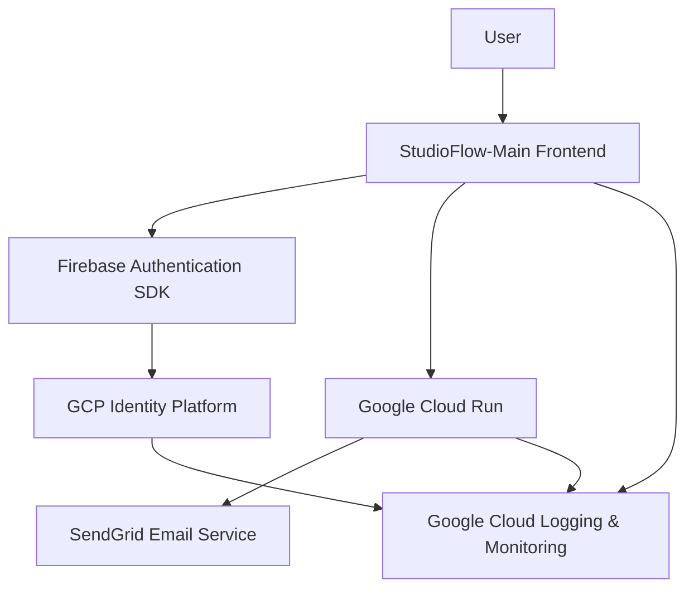
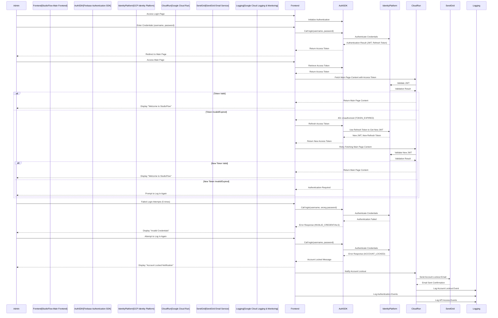

**StudioFlow-Main Application Framework Specification (Revised)**

---

# **StudioFlow-Main Application Framework Specification**

## **Table of Contents**
1. [Overview](#overview)
2. [Technology Stack and Architecture Overview](#technology-stack-and-architecture-overview)
3. [Authentication and Authorization](#authentication-and-authorization)
4. [Frontend Application](#frontend-application)
5. [Infrastructure as Code (IaC) with Terraform](#infrastructure-as-code-iac-with-terraform)
6. [Development Workflow](#development-workflow)
7. [Deployment to GCP](#deployment-to-gcp)
8. [Post-Deployment Monitoring](#post-deployment-monitoring)
9. [Continuous Integration/Continuous Deployment (CI/CD)](#continuous-integrationcontinuous-deployment-cicd)
10. [Unit Testing and Quality Assurance](#unit-testing-and-quality-assurance)
11. [Project Structure](#project-structure)
12. [Security Considerations](#security-considerations)
13. [Failover, Redundancy, and Disaster Recovery](#failover-redundancy-and-disaster-recovery)
14. [Cost Estimation Approach Using GCP Pricing Calculator](#cost-estimation-approach-using-gcp-pricing-calculator)
15. [Interaction Diagram](#interaction-diagram)
16. [Questions for Further Clarification](#questions-for-further-clarification)

---

## **Overview**

The **StudioFlow-Main** application framework serves as the foundational launchpad for users to design and manage workflows comprising various modules or microservices. These modules include functionalities such as auto retouch, capture, approval, sample check-in, etc. The framework handles user authentication, provides a seamless login experience, and directs authenticated users to the main interface where they can construct and customize their workflows.

**Key Features:**
- **Authentication**: Secure user login using GCP's Identity Platform.
- **Landing Page**: A login interface for user authentication.
- **Main Page**: Post-login dashboard with "Welcome to StudioFlow" message and a workflow designer.
- **Workflow Designer**: Allows users to add predefined modules via a React Flow-based interface using JSON configurations.
- **Scalable Architecture**: Designed to accommodate additional modules/microservices.
- **Infrastructure as Code**: Deployment and resource management via Terraform.
- **CI/CD Integration**: Automated testing and deployment pipelines.
- **Responsive Design**: Ensures usability across desktops, tablets, and mobile devices.

---

## **Technology Stack and Architecture Overview**

### **Core Components**
1. **Frontend**:
   - **Framework**: React.js
   - **Language**: JavaScript (ES6+)
   - **Styling**: CSS3, with a UI library like Material-UI or Tailwind CSS.
   - **Workflow Designer**: React Flow for visual workflow creation.

2. **Authentication**:
   - **Service**: GCP Identity Platform
   - **SDK**: Firebase Authentication SDK

3. **Infrastructure**:
   - **Provisioning**: Terraform
   - **Hosting**: Google Cloud Run
   - **API Management**: GCP API Gateway (for future microservices integration)

4. **Version Control**:
   - **Repository**: Git (e.g., GitHub, GitLab)

5. **CI/CD**:
   - **Tools**: GitHub Actions, GitLab CI/CD, or Google Cloud Build

6. **Monitoring and Logging**:
   - **Services**: Google Cloud Monitoring, Google Cloud Logging

7. **Email Service**:
   - **Service**: SendGrid (via GCP Marketplace for simplicity)

### **Architecture Diagram**



*Diagram Description*: Users interact with the **StudioFlow-Main Frontend**, initiating authentication via the Firebase Authentication SDK. Upon successful login, JWT access tokens are used to fetch main page content from Google Cloud Run. The API Gateway validates tokens with **Identity Platform**, and all activities are logged in **Google Cloud Logging & Monitoring**. Email notifications (e.g., account lockouts) are handled via SendGrid.

---

## **Authentication and Authorization**

### **Overview**

Authentication is managed by GCP's **Identity Platform**, ensuring secure and scalable user management. The frontend application leverages the Firebase Authentication SDK to handle user sessions, token management, and secure communication with GCP services. Only administrators can register users, aligning with the requirement of no self-service registration.

### **Authentication Flow**

1. **User Login**:
   - Users access the **Login Page** and submit their credentials.
   - The **Firebase Authentication SDK** communicates with **Identity Platform** to authenticate the user.
   - Upon successful authentication, **Identity Platform** issues a **JWT Access Token** and a **Refresh Token**.

2. **Token Management**:
   - **Access Token**: Stored securely in memory within the frontend application. Used for authenticating API requests.
   - **Refresh Token**: Stored in a secure, HTTP-only cookie with `SameSite=Strict` attribute to prevent XSS and CSRF attacks.

3. **Session Handling**:
   - Access tokens have a short lifespan (e.g., 15 minutes) to minimize security risks.
   - Refresh tokens are used to obtain new access tokens without requiring the user to re-authenticate.

### **Authorization**

Authorization is based on user roles (`customer_user` and `studio_admin`) and `customer_id`. Custom claims embedded within JWTs facilitate role-based access control (RBAC) without additional database queries.

---

## **Frontend Application**

### **Overview**

The frontend is a React.js application that provides the user interface for authentication and workflow design. It consists of two main pages:

1. **Login Page**: Allows administrators to log in.
2. **Main Page**: Displays a welcome message post-login and includes a workflow designer for adding predefined modules.

### **Page Descriptions**

1. **Login Page**
   - **Components**:
     - **Username Input**: Field for admin email or username.
     - **Password Input**: Field for admin password.
     - **Login Button**: Triggers the authentication process.
     - **Error Messages**: Displays authentication errors (e.g., invalid credentials, account locked).
   - **Functionality**:
     - Utilizes the Firebase Authentication SDK to handle admin login.
     - Upon successful login, redirects the admin to the Main Page.
     - Handles and displays error messages based on authentication responses.

2. **Main Page**
   - **Components**:
     - **Welcome Message**: Displays "Welcome to StudioFlow" centered on the page.
     - **Workflow Designer**: React Flow-based interface allowing admins to add predefined modules via JSON configurations.
   - **Functionality**:
     - Serves as the central hub for designing workflows.
     - Allows admins to add, configure, and sequence predefined modules/microservices by importing JSON definitions.
     - Future enhancements will include dynamic interaction with backend microservices for workflow execution.

### **Workflow Designer Details**

- **Predefined Modules**: Modules such as auto retouch, capture, approval, sample check-in, etc., adhere to a predefined structure.
- **Module Configuration**: Modules are defined via JSON strings specifying inputs, outputs, and calling instructions.
- **Workflow Execution**: The workflow designer manages the sequence of module executions based on the configured JSON definitions.

### **User Interface Design**

- **Responsive Design**: Ensures usability across desktops, tablets, and mobile devices.
- **Consistent Styling**: Utilizes a UI library (e.g., Material-UI) for a cohesive look and feel.
- **Accessibility**: Adheres to accessibility standards (e.g., WCAG) to support all users.

### **Sample Component Structure**

```
src/
├── components/
│   ├── Login.js
│   ├── MainPage.js
│   ├── WorkflowDesigner.js
│   └── ... (additional components)
├── App.js
├── index.js
└── ... (additional files)
```

---

## **Infrastructure as Code (IaC) with Terraform**

### **Overview**

Infrastructure is managed using **Terraform**, enabling consistent and repeatable deployments across DEV, UAT, and PRD environments. Terraform scripts provision necessary GCP resources, including Identity Platform configurations, Cloud Run services, API Gateway setup, Firestore, SendGrid integration, and IAM roles.

### **Key Infrastructure Components**

1. **GCP Identity Platform**
   - **Configuration**: Set up authentication methods (e.g., Email/Password).
   - **Custom Claims**: Embed user roles and `customer_id` within JWTs.

2. **Google Cloud Run**
   - **Service Deployment**: Hosts the frontend application.
   - **Scaling**: Automatically scales based on traffic.

3. **Google API Gateway**
   - **API Management**: Facilitates routing, rate limiting, and security for future microservices.

4. **Firestore**
   - **User Metadata Storage**: Optional, for storing additional user information if required.

5. **SendGrid Email Service**
   - **Purpose**: Handle administrative email notifications (e.g., account lockouts).
   - **Integration**: Configure SendGrid via GCP Marketplace for simplicity.

6. **IAM Roles and Permissions**
   - **Service Accounts**: Manage access to GCP resources.
   - **Role Assignments**: Apply least privilege principles for security.

7. **Networking**
   - **VPC Configuration**: Ensure secure and efficient network communication.

### **Terraform Directory Structure**

```
infra/
└── terraform/
    ├── main.tf
    ├── variables.tf
    ├── outputs.tf
    └── environments/
        ├── dev.tfvars
        ├── uat.tfvars
        └── prd.tfvars
```

### **Sample Terraform Configuration (`main.tf`)**

```hcl
provider "google" {
  project = var.project_id
  region  = var.region
}

# Enable necessary APIs
resource "google_project_service" "identity_platform" {
  service = "identitytoolkit.googleapis.com"
}

resource "google_project_service" "cloud_run" {
  service = "run.googleapis.com"
}

resource "google_project_service" "api_gateway" {
  service = "apigateway.googleapis.com"
}

resource "google_project_service" "firestore" {
  service = "firestore.googleapis.com"
}

resource "google_project_service" "sendgrid" {
  service = "sendgrid.googleapis.com"
}

# Identity Platform Configuration
resource "google_identity_platform_config" "default" {
  project = var.project_id
}

# Cloud Run Service
resource "google_cloud_run_service" "frontend" {
  name     = "studioflow-frontend"
  location = var.region

  template {
    spec {
      containers {
        image = var.frontend_image
        ports {
          container_port = 80
        }
      }
    }
  }

  traffic {
    percent         = 100
    latest_revision = true
  }
}

# IAM Role for Cloud Run
resource "google_cloud_run_service_iam_member" "invoker" {
  service  = google_cloud_run_service.frontend.name
  location = google_cloud_run_service.frontend.location
  role     = "roles/run.invoker"
  member   = "allUsers"
}

# SendGrid Integration
resource "google_sendgrid_account" "sendgrid" {
  # Placeholder for SendGrid setup via GCP Marketplace or API
  # Actual configuration may vary based on SendGrid integration method
}

# Outputs
output "frontend_url" {
  value = google_cloud_run_service.frontend.status[0].url
}
```

### **Terraform Variables (`variables.tf`)**

```hcl
variable "project_id" {
  description = "GCP Project ID"
  type        = string
}

variable "region" {
  description = "GCP Region"
  type        = string
  default     = "us-central1"
}

variable "frontend_image" {
  description = "Container image for the frontend application"
  type        = string
}

# Add variables for SendGrid and other services as needed
```

### **Environment-Specific Variable Files (`dev.tfvars`, `uat.tfvars`, `prd.tfvars`)**

```hcl
# Example: dev.tfvars
project_id     = "studioflow-dev"
region         = "us-central1"
frontend_image = "gcr.io/studioflow-dev/studioflow-frontend:latest"
```

### **Setup Instructions**

1. **Install Terraform**:
   - Follow the [official installation guide](https://learn.hashicorp.com/tutorials/terraform/install-cli) for Terraform.

2. **Authenticate with GCP**:
   - Use the `gcloud` CLI to authenticate:
     ```bash
     gcloud auth login
     gcloud config set project studioflow-dev
     ```

3. **Initialize Terraform**:
   - Navigate to the `infra/terraform` directory and run:
     ```bash
     terraform init
     ```

4. **Plan the Deployment**:
   - Generate an execution plan:
     ```bash
     terraform plan -var-file=environments/dev.tfvars
     ```

5. **Apply the Configuration**:
   - Deploy the infrastructure:
     ```bash
     terraform apply -var-file=environments/dev.tfvars
     ```

6. **Verify Deployment**:
   - Check the outputs for service URLs and confirm resources in the GCP Console.

---

## **Development Workflow**

### **1. Set Up Development Environment**

#### **1.1. Install Required Tools**

- **Node.js**: Install version `16.x` or higher from [Node.js Official Website](https://nodejs.org/).
- **Visual Studio Code (VS Code)**: Recommended IDE with the following extensions:
  - **Prettier**: For code formatting.
  - **ESLint**: For linting JavaScript code.
  - **Terraform**: For Infrastructure as Code support.
  - **Google Cloud Tools**: For seamless integration with GCP services.
- **Git**: Version control system. Install from [Git Official Website](https://git-scm.com/).

#### **1.2. Clone the Repository**

```bash
git clone https://github.com/your-org/studioflow-main.git
cd studioflow-main
```

#### **1.3. Install Dependencies**

Navigate to the frontend directory and install necessary packages:

```bash
cd frontend/react-app
npm install
```

### **2. Frontend Development**

#### **2.1. Implement Login Page**

- **Components**:
  - `Login.js`: Handles admin user input and authentication.

- **Functionality**:
  - Utilize Firebase Authentication SDK to handle admin login.
  - Manage access and refresh tokens securely.
  - Redirect authenticated admins to the Main Page.
  - Handle and display error messages based on authentication responses.

#### **2.2. Implement Main Page**

- **Components**:
  - `MainPage.js`: Displays "Welcome to StudioFlow" centered on the page.
  - `WorkflowDesigner.js`: React Flow-based interface for adding predefined modules via JSON configurations.

- **Functionality**:
  - Serve as the central hub for designing workflows.
  - Allow admins to add, configure, and sequence predefined modules/microservices by importing JSON definitions.
  - Handle the execution sequence of workflow steps based on JSON configurations.

### **3. Authentication SDK Integration**

- **Firebase Authentication SDK**:
  - Integrate within the React application to manage authentication flows.
  - Handle token storage in memory and refresh tokens via HTTP-only cookies.

### **4. Environment Configuration**

- **Environment Variables**:
  - Store sensitive information using `.env` files and Google Secret Manager.
  - Example `.env` file:

    ```dotenv
    REACT_APP_FIREBASE_API_KEY=your_firebase_api_key
    REACT_APP_FIREBASE_AUTH_DOMAIN=your_project_id.firebaseapp.com
    REACT_APP_FIREBASE_PROJECT_ID=your_project_id
    REACT_APP_FIREBASE_STORAGE_BUCKET=your_project_id.appspot.com
    REACT_APP_FIREBASE_MESSAGING_SENDER_ID=your_sender_id
    REACT_APP_FIREBASE_APP_ID=your_app_id
    ```

### **5. Code Standards and Best Practices**

- **Linting**:
  - Use ESLint with Airbnb style guide.
  - Run linting with:
    ```bash
    npm run lint
    ```

- **Formatting**:
  - Use Prettier for consistent code formatting.
  - Run formatting with:
    ```bash
    npm run format
    ```

- **Commit Hooks**:
  - Implement Git hooks using Husky to enforce linting and testing before commits.

---

## **Deployment to GCP**

### **Overview**

Deployment involves packaging the React application into a container image and deploying it to **Google Cloud Run**. Terraform scripts automate the provisioning and deployment process across different environments.

### **Deployment Steps**

1. **Build the React Application**

   ```bash
   cd frontend/react-app
   npm run build
   ```

2. **Containerize the Application**

   - Create a `Dockerfile` in the `frontend/react-app` directory:

     ```dockerfile
     # Use an official Node.js runtime as the base image
     FROM node:16-alpine as build

     # Set working directory
     WORKDIR /app

     # Copy package.json and package-lock.json
     COPY package*.json ./

     # Install dependencies
     RUN npm install

     # Copy the rest of the application code
     COPY . .

     # Build the application
     RUN npm run build

     # Serve the app using nginx
     FROM nginx:stable-alpine
     COPY --from=build /app/build /usr/share/nginx/html

     # Expose port 80
     EXPOSE 80

     # Start nginx
     CMD ["nginx", "-g", "daemon off;"]
     ```

3. **Build and Push the Docker Image**

   - **Authenticate with GCP Container Registry**:

     ```bash
     gcloud auth configure-docker
     ```

   - **Build the Docker Image**:

     ```bash
     docker build -t gcr.io/your-project-id/studioflow-frontend:latest .
     ```

   - **Push the Docker Image**:

     ```bash
     docker push gcr.io/your-project-id/studioflow-frontend:latest
     ```

4. **Deploy to Google Cloud Run Using Terraform**

   - **Update Terraform Variables**:
     - Ensure `frontend_image` in `variables.tf` points to the newly pushed image:
       ```hcl
       variable "frontend_image" {
         description = "Container image for the frontend application"
         type        = string
         default     = "gcr.io/your-project-id/studioflow-frontend:latest"
       }
       ```

   - **Apply Terraform Configuration**:

     ```bash
     cd infra/terraform
     terraform init
     terraform apply -var-file=environments/dev.tfvars
     ```

   - **Access the Deployed Application**:
     - Terraform output will provide the `frontend_url`. Open it in a browser to verify.

---

## **Post-Deployment Monitoring**

### **Overview**

Monitoring and logging are crucial for maintaining application health, performance, and security. GCP's **Cloud Monitoring** and **Cloud Logging** services provide comprehensive observability.

### **Cloud Logging**

- **Purpose**: Capture and store logs from the frontend application and GCP services.
- **Setup**:
  - Ensure that **Cloud Run** is configured to send logs to **Cloud Logging**.
  - Access logs via the GCP Console under **Logging**.

### **Cloud Monitoring**

- **Purpose**: Monitor metrics such as request rates, error rates, latency, and resource utilization.
- **Setup**:
  - Create **Dashboards** to visualize key metrics.
  - Configure **Alerting Policies** to notify the team of anomalies or critical issues.

### **Sample Monitoring Metrics**

- **Cloud Run**:
  - CPU and Memory Usage
  - Request Count
  - Request Latency
  - Error Rates

- **Identity Platform**:
  - Authentication Attempts
  - Successful vs. Failed Logins

- **SendGrid**:
  - Email Sending Metrics (e.g., delivery rates, bounce rates)

---

## **Continuous Integration/Continuous Deployment (CI/CD)**

### **Overview**

Implementing CI/CD pipelines ensures that code changes are automatically tested and deployed, enhancing development efficiency and reducing the risk of errors.

### **Tools**

- **GitHub Actions**: For automating workflows.
- **Terraform**: For infrastructure provisioning.
- **Docker**: For containerizing applications.
- **Google Cloud CLI**: For interacting with GCP services.

### **Pipeline Configuration**

1. **CI Pipeline (Continuous Integration)**
   - **Triggers**: On pull requests and commits to specific branches (e.g., `main`, `develop`).
   - **Steps**:
     - **Checkout Code**: Retrieve the latest code from the repository.
     - **Set Up Node.js**: Install the specified Node.js version.
     - **Install Dependencies**: Run `npm install`.
     - **Linting**: Run ESLint to ensure code quality.
     - **Testing**: Execute unit and integration tests using Jest.
     - **Build Docker Image**: Build the frontend application into a Docker image.
     - **Push Docker Image**: Push the image to Google Container Registry.

2. **CD Pipeline (Continuous Deployment)**
   - **Triggers**: On successful CI pipeline completion, especially on merges to `main`.
   - **Steps**:
     - **Authenticate with GCP**: Use service account credentials.
     - **Apply Terraform Configuration**: Deploy infrastructure changes.
     - **Deploy Application**: Update the Cloud Run service with the new Docker image.
     - **Notify Team**: Send deployment status notifications via Slack or email.

### **Sample GitHub Actions Workflow (`.github/workflows/ci-cd.yml`)**

```yaml
name: CI/CD Pipeline

on:
  push:
    branches:
      - main
      - develop
  pull_request:
    branches:
      - main
      - develop

jobs:
  build:
    runs-on: ubuntu-latest

    steps:
    - name: Checkout Code
      uses: actions/checkout@v3

    - name: Set up Node.js
      uses: actions/setup-node@v3
      with:
        node-version: '16'

    - name: Install Dependencies
      run: |
        cd frontend/react-app
        npm install

    - name: Lint Code
      run: |
        cd frontend/react-app
        npm run lint

    - name: Run Tests
      run: |
        cd frontend/react-app
        npm run test -- --coverage

    - name: Build Docker Image
      run: |
        docker build -t gcr.io/${{ secrets.GCP_PROJECT_ID }}/studioflow-frontend:${{ github.sha }} frontend/react-app

    - name: Authenticate to Google Cloud
      uses: google-github-actions/auth@v1
      with:
        credentials_json: ${{ secrets.GCP_CREDENTIALS }}

    - name: Push Docker Image
      run: |
        docker push gcr.io/${{ secrets.GCP_PROJECT_ID }}/studioflow-frontend:${{ github.sha }}

    - name: Deploy to Cloud Run
      run: |
        cd infra/terraform
        terraform init
        terraform apply -auto-approve -var "frontend_image=gcr.io/${{ secrets.GCP_PROJECT_ID }}/studioflow-frontend:${{ github.sha }}"
```

### **Secrets Management**

- **GitHub Secrets**:
  - `GCP_PROJECT_ID`: Your GCP project ID.
  - `GCP_CREDENTIALS`: JSON key for a service account with necessary permissions.

---

## **Unit Testing and Quality Assurance**

### **Overview**

Ensuring code quality through automated testing is vital for maintaining application reliability and facilitating future development.

### **Testing Frameworks**

- **Frontend**:
  - **Jest**: For running unit and integration tests.
  - **React Testing Library**: For testing React components.

### **Testing Strategies**

1. **Unit Tests**
   - **Components**: Test individual React components for correct rendering and functionality.
   - **Functions**: Test utility functions and services for expected outputs.

2. **Integration Tests**
   - **Authentication Flow**: Test the login process, including successful and failed authentication attempts.
   - **Workflow Designer**: Verify that workflows can be created, saved, and executed based on JSON configurations.

3. **End-to-End (E2E) Tests** (Future Enhancement)
   - Utilize tools like **Cypress** or **Selenium** to simulate user interactions and validate application flows.

### **Sample Test Case for Login Component (`Login.test.js`)**

```javascript
import React from 'react';
import { render, fireEvent, screen } from '@testing-library/react';
import Login from './Login';
import AuthSDK from 'studioflow-auth-sdk';

jest.mock('studioflow-auth-sdk');

describe('Login Component', () => {
  it('renders login form', () => {
    render(<Login />);
    expect(screen.getByLabelText(/username/i)).toBeInTheDocument();
    expect(screen.getByLabelText(/password/i)).toBeInTheDocument();
    expect(screen.getByRole('button', { name: /login/i })).toBeInTheDocument();
  });

  it('handles successful login', async () => {
    AuthSDK.prototype.login.mockResolvedValueOnce();
    render(<Login />);
    
    fireEvent.change(screen.getByLabelText(/username/i), { target: { value: 'admin@studioflow.app' } });
    fireEvent.change(screen.getByLabelText(/password/i), { target: { value: 'password123!' } });
    fireEvent.click(screen.getByRole('button', { name: /login/i }));
    
    // Add assertions for redirection or success messages
    // Example:
    // expect(await screen.findByText(/welcome/i)).toBeInTheDocument();
  });

  it('displays error on failed login', async () => {
    AuthSDK.prototype.login.mockRejectedValueOnce(new Error('INVALID_CREDENTIALS'));
    render(<Login />);
    
    fireEvent.change(screen.getByLabelText(/username/i), { target: { value: 'admin@studioflow.app' } });
    fireEvent.change(screen.getByLabelText(/password/i), { target: { value: 'wrongpassword' } });
    fireEvent.click(screen.getByRole('button', { name: /login/i }));
    
    expect(await screen.findByText(/invalid credentials/i)).toBeInTheDocument();
  });

  it('displays account locked message after multiple failed attempts', async () => {
    AuthSDK.prototype.login.mockRejectedValue(new Error('ACCOUNT_LOCKED'));
    render(<Login />);
    
    // Simulate multiple failed attempts
    for (let i = 0; i < 5; i++) {
      fireEvent.change(screen.getByLabelText(/username/i), { target: { value: 'admin@studioflow.app' } });
      fireEvent.change(screen.getByLabelText(/password/i), { target: { value: 'wrongpassword' } });
      fireEvent.click(screen.getByRole('button', { name: /login/i }));
    }
    
    // Attempt login after account is locked
    fireEvent.change(screen.getByLabelText(/username/i), { target: { value: 'admin@studioflow.app' } });
    fireEvent.change(screen.getByLabelText(/password/i), { target: { value: 'correctpassword' } });
    fireEvent.click(screen.getByRole('button', { name: /login/i }));
    
    expect(await screen.findByText(/account locked/i)).toBeInTheDocument();
  });
});
```

### **Running Tests**

```bash
cd frontend/react-app
npm run test
```

### **Code Coverage**

- **Generate Coverage Reports**:
  - Ensure high code coverage to catch potential issues.
  - Configure Jest to collect coverage data:
    ```json
    // package.json
    "jest": {
      "collectCoverage": true,
      "coverageDirectory": "coverage",
      "coverageReporters": ["html", "text"]
    }
    ```

- **View Coverage Reports**:
  - Open `frontend/react-app/coverage/index.html` in a browser.

---

## **Project Structure**

```
studioflow-main/
├── frontend/
│   └── react-app/
│       ├── public/
│       │   └── index.html
│       ├── src/
│       │   ├── components/
│       │   │   ├── Login.js
│       │   │   ├── MainPage.js
│       │   │   ├── WorkflowDesigner.js
│       │   │   └── ... (additional components)
│       │   ├── App.js
│       │   ├── index.js
│       │   └── ... (additional files)
│       ├── tests/
│       │   ├── Login.test.js
│       │   └── ... (additional tests)
│       ├── Dockerfile
│       ├── package.json
│       └── README.md
├── infra/
│   └── terraform/
│       ├── main.tf
│       ├── variables.tf
│       ├── outputs.tf
│       └── environments/
│           ├── dev.tfvars
│           ├── uat.tfvars
│           └── prd.tfvars
├── .github/
│   └── workflows/
│       └── ci-cd.yml
├── README.md
└── .gitignore
```

**Descriptions:**

- **frontend/react-app/**: Contains the React frontend application.
- **infra/terraform/**: Houses Terraform scripts for provisioning GCP resources.
- **.github/workflows/**: Contains GitHub Actions workflows for CI/CD pipelines.
- **README.md**: Project documentation.
- **.gitignore**: Specifies intentionally untracked files to ignore.

---

## **Security Considerations**

1. **Secure Communication**
   - **HTTPS**: Enforce HTTPS for all endpoints to encrypt data in transit.

2. **Token Security**
   - **Access Tokens**: Stored in memory to minimize XSS risks.
   - **Refresh Tokens**: Stored in HTTP-only, Secure, SameSite=Strict cookies to prevent XSS and CSRF attacks.

3. **Environment Variables and Secrets**
   - **Google Secret Manager**: Store sensitive information like API keys and secrets.
   - **Access Controls**: Restrict access to secrets based on IAM roles.

4. **Authentication Best Practices**
   - **Strong Password Policies**: Enforce complex passwords and regular rotations.
   - **Account Lockout**: After 5 failed login attempts, lock the account for 15 minutes and notify via email.

5. **Rate Limiting**
   - **API Gateway**: Configure rate limits to protect against brute-force attacks and abuse.

6. **Regular Audits**
   - **IAM Auditing**: Regularly review IAM roles and permissions.
   - **Security Scans**: Utilize tools like **Dependabot** or **Snyk** to identify vulnerabilities.

7. **Data Protection**
   - **Encryption**: Ensure data at rest and in transit is encrypted.
   - **Compliance**: Align with basic data privacy regulations, favoring simplicity.

8. **Email Security**
   - **SendGrid Integration**: Use SendGrid for sending administrative emails securely, such as account lockout notifications.

---

## **Failover, Redundancy, and Disaster Recovery**

### **Overview**

Ensuring high availability and data integrity is paramount. The **StudioFlow-Main** application leverages GCP’s inherent redundancy and failover mechanisms to maintain service continuity with minimal costs.

### **Key Strategies**

1. **Multi-Region Deployment**
   - **Cloud Run**: Deploy services in multiple regions to mitigate regional outages.
   - **Firestore**: Utilize multi-region configurations for data redundancy.

2. **Load Balancing and Auto-Scaling**
   - **Cloud Run**: Automatically scales based on traffic, ensuring consistent performance.
   - **API Gateway**: Distributes incoming requests evenly across available resources.

3. **Scheduled Backups**
   - **Firestore Backups**: Implement automated daily backups stored in separate regions.
   - **SendGrid Data**: Ensure email sending data is backed up via SendGrid's built-in mechanisms.

4. **Monitoring and Alerts**
   - **Cloud Monitoring**: Continuously monitor system metrics and health.
   - **Alerts**: Configure notifications for critical issues like service downtimes, high error rates, or resource exhaustion.

5. **Disaster Recovery Plan**
   - **Data Recovery**: Restore data from backups in case of corruption or loss.
   - **Service Failover**: Redirect traffic to backup regions if the primary region experiences issues.

6. **Regular Testing**
   - **Failover Drills**: Periodically simulate outages to test the effectiveness of redundancy measures.
   - **Backup Restoration**: Test backup restoration processes to ensure data integrity.

---

## **Cost Estimation Approach Using GCP Pricing Calculator**

### **Overview**

Accurately estimating costs is essential for budget planning and resource allocation. Utilize GCP’s Pricing Calculator to forecast expenses based on projected usage, favoring simplicity and minimal costs.

### **Steps for Cost Estimation**

1. **Identify Usage Metrics**
   - **Frontend Hosting**:
     - **Google Cloud Run**: Number of requests, memory allocation, and execution time.
   - **Authentication**:
     - **Identity Platform**: Number of active users and authentication requests.
   - **Email Service**:
     - **SendGrid**: Number of emails sent per month.
   - **Infrastructure**:
     - **API Gateway**: Number of API calls and data processed.
     - **Firestore**: Document reads, writes, deletes, and storage size.
   - **CI/CD Pipeline**:
     - **Cloud Build**: Number of builds per month.
   - **Monitoring and Logging**:
     - **Cloud Logging**: Volume of logs ingested.
     - **Cloud Monitoring**: Metrics and alerting.

2. **Use GCP Pricing Calculator**
   - Access the [GCP Pricing Calculator](https://cloud.google.com/products/calculator).
   - Input the identified usage metrics for each service.
   - Review the estimated monthly costs.

3. **Consider Additional Costs**
   - **Data Egress**: Charges for data transferred out of GCP.
   - **Third-Party Integrations**: Costs for SendGrid (email service).
   - **Secret Manager**: Number of secrets and access frequency.

4. **Apply Cost Optimization Strategies**
   - **Resource Allocation**: Choose appropriate resource sizes to match actual usage.
   - **Sustained Use Discounts**: Benefit from discounts for long-term usage.
   - **Committed Use Contracts**: Lock in resources at a discounted rate for a commitment period.

### **Sample Cost Components**

| GCP Service             | Estimated Monthly Usage   | Estimated Cost ($) |
|-------------------------|---------------------------|--------------------|
| Google Cloud Run        | 100,000 requests          | 5                  |
| Identity Platform       | 200 active users          | 10                 |
| SendGrid                | 1,000 emails              | 20                 |
| API Gateway             | 50,000 API calls          | 7.50               |
| Firestore               | 500,000 reads             | 15                 |
| Firestore               | 100,000 writes            | 20                 |
| Firestore               | 5 GB storage              | 0.09               |
| Cloud Logging           | 10 GB logs                | 2                  |
| Cloud Monitoring        | Basic metrics             | 5                  |
| Cloud Build             | 50 builds                 | 7.50               |
| **Total**               |                           | **81.09**          |

*Note: The above figures are illustrative. Actual costs will vary based on specific usage patterns.*

---

## **Interaction Diagram**

### **Overview**

The following Mermaid sequence diagram illustrates the interaction flow between the administrator, frontend application, GCP Identity Platform, Google Cloud Run, SendGrid, and Cloud Logging & Monitoring.



*Diagram Description*: Administrators interact with the **StudioFlow-Main Frontend**, initiating authentication via the Firebase Authentication SDK. Upon successful login, JWT access tokens are used to fetch main page content from Google Cloud Run. The API Gateway validates tokens with **Identity Platform**, and all activities are logged in **Google Cloud Logging & Monitoring**. Account lockouts trigger email notifications via SendGrid, ensuring administrators are informed of suspicious activities.

---

## **Security Considerations**

1. **Secure Communication**
   - **HTTPS**: Enforce HTTPS for all endpoints to encrypt data in transit.

2. **Token Security**
   - **Access Tokens**: Stored in memory to minimize XSS risks.
   - **Refresh Tokens**: Stored in HTTP-only, Secure, SameSite=Strict cookies to prevent XSS and CSRF attacks.

3. **Environment Variables and Secrets**
   - **Google Secret Manager**: Store sensitive information like API keys and secrets.
   - **Access Controls**: Restrict access to secrets based on IAM roles.

4. **Authentication Best Practices**
   - **Strong Password Policies**: Enforce complex passwords and regular rotations.
   - **Account Lockout**: After 5 failed login attempts, lock the account for 15 minutes and notify via email.

5. **Rate Limiting**
   - **API Gateway**: Configure rate limits to protect against brute-force attacks and abuse.

6. **Regular Audits**
   - **IAM Auditing**: Regularly review IAM roles and permissions.
   - **Security Scans**: Utilize tools like **Dependabot** or **Snyk** to identify vulnerabilities.

7. **Data Protection**
   - **Encryption**: Ensure data at rest and in transit is encrypted.
   - **Compliance**: Align with basic data privacy regulations, favoring simplicity.

8. **Email Security**
   - **SendGrid Integration**: Use SendGrid for sending administrative emails securely, such as account lockout notifications.

---

## **Failover, Redundancy, and Disaster Recovery**

### **Overview**

Ensuring high availability and data integrity is paramount. The **StudioFlow-Main** application leverages GCP’s inherent redundancy and failover mechanisms to maintain service continuity with minimal costs.

### **Key Strategies**

1. **Multi-Region Deployment**
   - **Cloud Run**: Deploy services in multiple regions to mitigate regional outages.
   - **Firestore**: Utilize multi-region configurations for data redundancy.

2. **Load Balancing and Auto-Scaling**
   - **Cloud Run**: Automatically scales based on traffic, ensuring consistent performance.
   - **API Gateway**: Distributes incoming requests evenly across available resources.

3. **Scheduled Backups**
   - **Firestore Backups**: Implement automated daily backups stored in separate regions.
   - **SendGrid Data**: Ensure email sending data is backed up via SendGrid's built-in mechanisms.

4. **Monitoring and Alerts**
   - **Cloud Monitoring**: Continuously monitor system metrics and health.
   - **Alerts**: Configure notifications for critical issues like service downtimes, high error rates, or resource exhaustion.

5. **Disaster Recovery Plan**
   - **Data Recovery**: Restore data from backups in case of corruption or loss.
   - **Service Failover**: Redirect traffic to backup regions if the primary region experiences issues.

6. **Regular Testing**
   - **Failover Drills**: Periodically simulate outages to test the effectiveness of redundancy measures.
   - **Backup Restoration**: Test backup restoration processes to ensure data integrity.

---

## **Cost Estimation Approach Using GCP Pricing Calculator**

### **Overview**

Accurately estimating costs is essential for budget planning and resource allocation. Utilize GCP’s Pricing Calculator to forecast expenses based on projected usage, favoring simplicity and minimal costs.

### **Steps for Cost Estimation**

1. **Identify Usage Metrics**
   - **Frontend Hosting**:
     - **Google Cloud Run**: Number of requests, memory allocation, and execution time.
   - **Authentication**:
     - **Identity Platform**: Number of active users and authentication requests.
   - **Email Service**:
     - **SendGrid**: Number of emails sent per month.
   - **Infrastructure**:
     - **API Gateway**: Number of API calls and data processed.
     - **Firestore**: Document reads, writes, deletes, and storage size.
   - **CI/CD Pipeline**:
     - **Cloud Build**: Number of builds per month.
   - **Monitoring and Logging**:
     - **Cloud Logging**: Volume of logs ingested.
     - **Cloud Monitoring**: Metrics and alerting.

2. **Use GCP Pricing Calculator**
   - Access the [GCP Pricing Calculator](https://cloud.google.com/products/calculator).
   - Input the identified usage metrics for each service.
   - Review the estimated monthly costs.

3. **Consider Additional Costs**
   - **Data Egress**: Charges for data transferred out of GCP.
   - **Third-Party Integrations**: Costs for SendGrid (email service).
   - **Secret Manager**: Number of secrets and access frequency.

4. **Apply Cost Optimization Strategies**
   - **Resource Allocation**: Choose appropriate resource sizes to match actual usage.
   - **Sustained Use Discounts**: Benefit from discounts for long-term usage.
   - **Committed Use Contracts**: Lock in resources at a discounted rate for a commitment period.

### **Sample Cost Components**

| GCP Service             | Estimated Monthly Usage   | Estimated Cost ($) |
|-------------------------|---------------------------|--------------------|
| Google Cloud Run        | 100,000 requests          | 5                  |
| Identity Platform       | 200 active users          | 10                 |
| SendGrid                | 1,000 emails              | 20                 |
| API Gateway             | 50,000 API calls          | 7.50               |
| Firestore               | 500,000 reads             | 15                 |
| Firestore               | 100,000 writes            | 20                 |
| Firestore               | 5 GB storage              | 0.09               |
| Cloud Logging           | 10 GB logs                | 2                  |
| Cloud Monitoring        | Basic metrics             | 5                  |
| Cloud Build             | 50 builds                 | 7.50               |
| **Total**               |                           | **81.09**          |

*Note: The above figures are illustrative. Actual costs will vary based on specific usage patterns.*

---

## **Interaction Diagram**

### **Overview**

The following Mermaid sequence diagram illustrates the interaction flow between the administrator, frontend application, GCP Identity Platform, Google Cloud Run, SendGrid, and Cloud Logging & Monitoring.


*Diagram Description*: Administrators interact with the **StudioFlow-Main Frontend**, initiating authentication via the Firebase Authentication SDK. Upon successful login, JWT access tokens are used to fetch main page content from Google Cloud Run. The API Gateway validates tokens with **Identity Platform**, and all activities are logged in **Google Cloud Logging & Monitoring**. Account lockouts trigger email notifications via SendGrid, ensuring administrators are informed of suspicious activities.

---

## **Unit Testing and Quality Assurance**

### **Overview**

Ensuring code quality through automated testing is vital for maintaining application reliability and facilitating future development.

### **Testing Frameworks**

- **Frontend**:
  - **Jest**: For running unit and integration tests.
  - **React Testing Library**: For testing React components.

### **Testing Strategies**

1. **Unit Tests**
   - **Components**: Test individual React components for correct rendering and functionality.
   - **Functions**: Test utility functions and services for expected outputs.

2. **Integration Tests**
   - **Authentication Flow**: Test the login process, including successful and failed authentication attempts.
   - **Workflow Designer**: Verify that workflows can be created, saved, and executed based on JSON configurations.

3. **End-to-End (E2E) Tests** (Future Enhancement)
   - Utilize tools like **Cypress** or **Selenium** to simulate user interactions and validate application flows.

### **Sample Test Case for Login Component (`Login.test.js`)**

```javascript
import React from 'react';
import { render, fireEvent, screen } from '@testing-library/react';
import Login from './Login';
import AuthSDK from 'studioflow-auth-sdk';

jest.mock('studioflow-auth-sdk');

describe('Login Component', () => {
  it('renders login form', () => {
    render(<Login />);
    expect(screen.getByLabelText(/username/i)).toBeInTheDocument();
    expect(screen.getByLabelText(/password/i)).toBeInTheDocument();
    expect(screen.getByRole('button', { name: /login/i })).toBeInTheDocument();
  });

  it('handles successful login', async () => {
    AuthSDK.prototype.login.mockResolvedValueOnce();
    render(<Login />);
    
    fireEvent.change(screen.getByLabelText(/username/i), { target: { value: 'admin@studioflow.app' } });
    fireEvent.change(screen.getByLabelText(/password/i), { target: { value: 'password123!' } });
    fireEvent.click(screen.getByRole('button', { name: /login/i }));
    
    // Add assertions for redirection or success messages
    // Example:
    // expect(await screen.findByText(/welcome/i)).toBeInTheDocument();
  });

  it('displays error on failed login', async () => {
    AuthSDK.prototype.login.mockRejectedValueOnce(new Error('INVALID_CREDENTIALS'));
    render(<Login />);
    
    fireEvent.change(screen.getByLabelText(/username/i), { target: { value: 'admin@studioflow.app' } });
    fireEvent.change(screen.getByLabelText(/password/i), { target: { value: 'wrongpassword' } });
    fireEvent.click(screen.getByRole('button', { name: /login/i }));
    
    expect(await screen.findByText(/invalid credentials/i)).toBeInTheDocument();
  });

  it('displays account locked message after multiple failed attempts', async () => {
    AuthSDK.prototype.login.mockRejectedValue(new Error('ACCOUNT_LOCKED'));
    render(<Login />);
    
    // Simulate multiple failed attempts
    for (let i = 0; i < 5; i++) {
      fireEvent.change(screen.getByLabelText(/username/i), { target: { value: 'admin@studioflow.app' } });
      fireEvent.change(screen.getByLabelText(/password/i), { target: { value: 'wrongpassword' } });
      fireEvent.click(screen.getByRole('button', { name: /login/i }));
    }
    
    // Attempt login after account is locked
    fireEvent.change(screen.getByLabelText(/username/i), { target: { value: 'admin@studioflow.app' } });
    fireEvent.change(screen.getByLabelText(/password/i), { target: { value: 'correctpassword' } });
    fireEvent.click(screen.getByRole('button', { name: /login/i }));
    
    expect(await screen.findByText(/account locked/i)).toBeInTheDocument();
  });
});
```

### **Running Tests**

```bash
cd frontend/react-app
npm run test
```

### **Code Coverage**

- **Generate Coverage Reports**:
  - Ensure high code coverage to catch potential issues.
  - Configure Jest to collect coverage data:
    ```json
    // package.json
    "jest": {
      "collectCoverage": true,
      "coverageDirectory": "coverage",
      "coverageReporters": ["html", "text"]
    }
    ```

- **View Coverage Reports**:
  - Open `frontend/react-app/coverage/index.html` in a browser.

---

## **Project Structure**

```
studioflow-main/
├── frontend/
│   └── react-app/
│       ├── public/
│       │   └── index.html
│       ├── src/
│       │   ├── components/
│       │   │   ├── Login.js
│       │   │   ├── MainPage.js
│       │   │   ├── WorkflowDesigner.js
│       │   │   └── ... (additional components)
│       │   ├── App.js
│       │   ├── index.js
│       │   └── ... (additional files)
│       ├── tests/
│       │   ├── Login.test.js
│       │   └── ... (additional tests)
│       ├── Dockerfile
│       ├── package.json
│       └── README.md
├── infra/
│   └── terraform/
│       ├── main.tf
│       ├── variables.tf
│       ├── outputs.tf
│       └── environments/
│           ├── dev.tfvars
│           ├── uat.tfvars
│           └── prd.tfvars
├── .github/
│   └── workflows/
│       └── ci-cd.yml
├── README.md
└── .gitignore
```

**Descriptions:**

- **frontend/react-app/**: Contains the React frontend application, including components for login, main page, and workflow designer.
- **infra/terraform/**: Houses Terraform scripts for provisioning GCP resources.
- **.github/workflows/**: Contains GitHub Actions workflows for CI/CD pipelines.
- **README.md**: Project documentation.
- **.gitignore**: Specifies intentionally untracked files to ignore.

---

## **Security Considerations**

1. **Secure Communication**
   - **HTTPS**: Enforce HTTPS for all endpoints to encrypt data in transit.

2. **Token Security**
   - **Access Tokens**: Stored in memory to minimize XSS risks.
   - **Refresh Tokens**: Stored in HTTP-only, Secure, SameSite=Strict cookies to prevent XSS and CSRF attacks.

3. **Environment Variables and Secrets**
   - **Google Secret Manager**: Store sensitive information like API keys and secrets.
   - **Access Controls**: Restrict access to secrets based on IAM roles.

4. **Authentication Best Practices**
   - **Strong Password Policies**: Enforce complex passwords and regular rotations.
   - **Account Lockout**: After 5 failed login attempts, lock the account for 15 minutes and notify via email.

5. **Rate Limiting**
   - **API Gateway**: Configure rate limits to protect against brute-force attacks and abuse.

6. **Regular Audits**
   - **IAM Auditing**: Regularly review IAM roles and permissions.
   - **Security Scans**: Utilize tools like **Dependabot** or **Snyk** to identify vulnerabilities.

7. **Data Protection**
   - **Encryption**: Ensure data at rest and in transit is encrypted.
   - **Compliance**: Align with basic data privacy regulations, favoring simplicity.

8. **Email Security**
   - **SendGrid Integration**: Use SendGrid for sending administrative emails securely, such as account lockout notifications.

---

## **Failover, Redundancy, and Disaster Recovery**

### **Overview**

Ensuring high availability and data integrity is paramount. The **StudioFlow-Main** application leverages GCP’s inherent redundancy and failover mechanisms to maintain service continuity with minimal costs.

### **Key Strategies**

1. **Multi-Region Deployment**
   - **Cloud Run**: Deploy services in multiple regions to mitigate regional outages.
   - **Firestore**: Utilize multi-region configurations for data redundancy.

2. **Load Balancing and Auto-Scaling**
   - **Cloud Run**: Automatically scales based on traffic, ensuring consistent performance.
   - **API Gateway**: Distributes incoming requests evenly across available resources.

3. **Scheduled Backups**
   - **Firestore Backups**: Implement automated daily backups stored in separate regions.
   - **SendGrid Data**: Ensure email sending data is backed up via SendGrid's built-in mechanisms.

4. **Monitoring and Alerts**
   - **Cloud Monitoring**: Continuously monitor system metrics and health.
   - **Alerts**: Configure notifications for critical issues like service downtimes, high error rates, or resource exhaustion.

5. **Disaster Recovery Plan**
   - **Data Recovery**: Restore data from backups in case of corruption or loss.
   - **Service Failover**: Redirect traffic to backup regions if the primary region experiences issues.

6. **Regular Testing**
   - **Failover Drills**: Periodically simulate outages to test the effectiveness of redundancy measures.
   - **Backup Restoration**: Test backup restoration processes to ensure data integrity.

---

## **Cost Estimation Approach Using GCP Pricing Calculator**

### **Overview**

Accurately estimating costs is essential for budget planning and resource allocation. Utilize GCP’s Pricing Calculator to forecast expenses based on projected usage, favoring simplicity and minimal costs.

### **Steps for Cost Estimation**

1. **Identify Usage Metrics**
   - **Frontend Hosting**:
     - **Google Cloud Run**: Number of requests, memory allocation, and execution time.
   - **Authentication**:
     - **Identity Platform**: Number of active users and authentication requests.
   - **Email Service**:
     - **SendGrid**: Number of emails sent per month.
   - **Infrastructure**:
     - **API Gateway**: Number of API calls and data processed.
     - **Firestore**: Document reads, writes, deletes, and storage size.
   - **CI/CD Pipeline**:
     - **Cloud Build**: Number of builds per month.
   - **Monitoring and Logging**:
     - **Cloud Logging**: Volume of logs ingested.
     - **Cloud Monitoring**: Metrics and alerting.

2. **Use GCP Pricing Calculator**
   - Access the [GCP Pricing Calculator](https://cloud.google.com/products/calculator).
   - Input the identified usage metrics for each service.
   - Review the estimated monthly costs.

3. **Consider Additional Costs**
   - **Data Egress**: Charges for data transferred out of GCP.
   - **Third-Party Integrations**: Costs for SendGrid (email service).
   - **Secret Manager**: Number of secrets and access frequency.

4. **Apply Cost Optimization Strategies**
   - **Resource Allocation**: Choose appropriate resource sizes to match actual usage.
   - **Sustained Use Discounts**: Benefit from discounts for long-term usage.
   - **Committed Use Contracts**: Lock in resources at a discounted rate for a commitment period.

### **Sample Cost Components**

| GCP Service             | Estimated Monthly Usage   | Estimated Cost ($) |
|-------------------------|---------------------------|--------------------|
| Google Cloud Run        | 100,000 requests          | 5                  |
| Identity Platform       | 200 active users          | 10                 |
| SendGrid                | 1,000 emails              | 20                 |
| API Gateway             | 50,000 API calls          | 7.50               |
| Firestore               | 500,000 reads             | 15                 |
| Firestore               | 100,000 writes            | 20                 |
| Firestore               | 5 GB storage              | 0.09               |
| Cloud Logging           | 10 GB logs                | 2                  |
| Cloud Monitoring        | Basic metrics             | 5                  |
| Cloud Build             | 50 builds                 | 7.50               |
| **Total**               |                           | **81.09**          |

*Note: The above figures are illustrative. Actual costs will vary based on specific usage patterns.*

---

## **Interaction Diagram**

### **Overview**

The following Mermaid sequence diagram illustrates the interaction flow between the administrator, frontend application, GCP Identity Platform, Google Cloud Run, SendGrid, and Cloud Logging & Monitoring.


*Diagram Description*: Administrators interact with the **StudioFlow-Main Frontend**, initiating authentication via the Firebase Authentication SDK. Upon successful login, JWT access tokens are used to fetch main page content from Google Cloud Run. The API Gateway validates tokens with **Identity Platform**, and all activities are logged in **Google Cloud Logging & Monitoring**. Account lockouts trigger email notifications via SendGrid, ensuring administrators are informed of suspicious activities.

